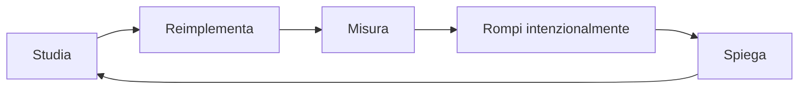

# Guida completa: metodo, metriche e riproducibilità

## 1. Come studiare competenze applicate

Leggere produce familiarità, non competenza. Per ogni concetto usa questo ciclo:



1. **Studia:** comprendi scopo, assunzioni e limiti.
2. **Reimplementa:** chiudi la fonte e ricostruisci un esempio minimo.
3. **Misura:** aggiungi una metrica e una baseline.
4. **Rompi:** prova input invalido, timeout, dati mancanti e concorrenza.
5. **Spiega:** registra una spiegazione di tre minuti con i trade-off.

Se sai eseguire il tutorial ma non sai prevedere il comportamento quando una
dipendenza fallisce, la competenza non è ancora pronta per la produzione.

## 2. Tradurre una richiesta in problema misurabile

Una richiesta come "creiamo un chatbot HR" è una soluzione, non un problema. Prima
scrivi una scheda:

| Campo | Esempio |
|---|---|
| Utente | operatore payroll autenticato |
| Decisione | trovare la procedura corretta per un'anomalia |
| Input | domanda, paese, ruolo, tenant |
| Output | risposta con citazioni oppure astensione |
| Baseline | ricerca keyword nella knowledge base |
| Errore costoso | indicazione payroll errata |
| KPI prodotto | ticket risolti senza escalation |
| Quality metric | correctness e citation precision |
| SLO | disponibilità e latenza p95 concordate |
| Non-obiettivo | modificare cedolini automaticamente |

### KPI, proxy e guardrail

- **KPI:** misura l'effetto finale, per esempio task completion.
- **Proxy offline:** consente iterazione rapida, per esempio Recall@5.
- **Guardrail:** non deve peggiorare, per esempio cross-tenant leakage uguale a zero.

Una proxy può migliorare senza migliorare il prodotto. Più Recall@5 può aggiungere
rumore al contesto e ridurre la correttezza finale. Per questo misura i layer
separatamente e poi il task end-to-end.

## 3. Baseline prima dell'AI

La baseline risponde a due domande:

1. l'AI aggiunge valore rispetto a una soluzione semplice?
2. la pipeline di valutazione è capace di rilevare differenze?

Esempi:

- classificazione: classe più frequente e regressione logistica;
- RAG: BM25 senza generazione;
- agente: workflow con regole;
- summarization: estrazione delle prime frasi;
- anomaly detection: soglia statistica.

Se il sistema complesso non batte la baseline sul criterio concordato, non va
rilasciato solo perché la demo appare convincente.

## 4. Requisiti non funzionali

Per un sistema AI specifica almeno:

- **affidabilità:** error budget, retry, degradation;
- **latenza:** time-to-first-token e durata totale;
- **costo:** per richiesta, utente e mese;
- **privacy:** PII, retention, localizzazione dati;
- **sicurezza:** tenant isolation, authorization, audit;
- **operabilità:** dashboard, alert, runbook, rollback;
- **riproducibilità:** versioni di codice, dati, prompt, modello e indice.

I numeri non sono universali. Derivano dal flusso utente e dal costo di errore.

## 5. Riproducibilità

Un esperimento è riproducibile quando un collega può ottenere lo stesso artefatto e
metriche compatibili partendo da un commit e da dati versionati.

Registra:

```text
run_id
git_commit
dataset_version + query/snapshot
split_strategy + seed
feature/chunking version
model/provider/version
prompt version
hyperparameters
environment/container digest
metrics + segment metrics
artifact URI
```

Il seed non rende deterministici provider esterni o GPU, ma elimina una fonte di
varianza e rende esplicite le altre.

### Struttura di progetto minima

```text
src/                 # codice importabile
tests/               # unit e integration
configs/             # configurazione versionata, non segreti
data/README.md       # origine e contratto dati
scripts/             # entry point sottili
pyproject.toml
.env.example
README.md
```

Il notebook è utile per esplorare. La logica stabilizzata va estratta in funzioni,
package e comandi ripetibili.

## 6. Experiment card

Prima di eseguire un esperimento compila:

```text
Ipotesi:
Se cambio:
Mi aspetto:
Perché:
Dataset e segmenti:
Metrica primaria:
Guardrail:
Soglia go/no-go:
Possibili confondenti:
```

Dopo l'esperimento:

```text
Risultato:
Intervallo/varianza:
Decisione:
Nuova domanda:
```

Cambiare contemporaneamente modello, prompt e chunking impedisce di attribuire il
risultato a una causa.

## 7. ADR: decisioni tecniche spiegabili

Un Architecture Decision Record breve contiene:

1. **contesto:** problema e vincoli;
2. **decisione:** scelta concreta;
3. **alternative:** almeno due opzioni serie;
4. **conseguenze:** vantaggi, costi e nuovi rischi;
5. **evidenza:** benchmark o esperimento;
6. **revisione:** condizione che riapre la decisione.

### Esempio sintetico

```text
Decisione: usare retrieval ibrido BM25+dense.
Contesto: i documenti contengono codici payroll e domande in linguaggio naturale.
Alternative: solo BM25; solo dense.
Evidenza: hybrid aumenta Recall@5 sui codici senza ridurre il segmento semantico.
Conseguenze: due indici e tuning della fusione.
Revisione: rivalutare se il costo p95 supera il budget o cambia il corpus.
```

## 8. Laboratorio guidato

Progetta un "HR Policy Assistant" senza ancora implementarlo.

1. Scrivi 10 domande reali e identifica chi può porle.
2. Per ogni domanda indica fonti autorizzate e risposta non consentita.
3. Definisci baseline keyword.
4. Scegli una metrica per retrieval, una end-to-end e due guardrail.
5. Disegna flusso happy path e tre failure path.
6. Compila experiment card e ADR iniziale.
7. Crea un backlog ordinato: baseline, dati, eval, servizio, monitoring.

## 9. Soluzione di riferimento

Una soluzione valida non è un testo identico, ma deve mostrare:

- domanda e popolazione definite, non "tutti gli utenti";
- ACL applicata prima del retrieval;
- casi answerable e unanswerable nel dataset;
- baseline misurata;
- separazione fra retrieval quality e answer quality;
- rollback a indice e prompt precedenti;
- nessuna azione di scrittura nel primo rilascio;
- owner e risposta operativa per ogni alert.

**Errore tipico:** scegliere subito LangChain, vector DB e modello. La tecnologia viene
dopo problema, rischio, dati e criterio di successo.
