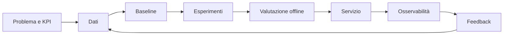

# 00 - Setup, baseline e metodo

## Obiettivo

Creare un ambiente riproducibile e misurare il punto di partenza. Il corso non premia
quanti notebook completi, ma quanti sistemi sai progettare, misurare e gestire.

**Inizia da qui:** [lezione passo-passo per chi parte da zero](LEZIONE.md).

**Dopo la lezione:** [approfondimento su metodo e riproducibilità](GUIDA.md).

## Schema del lavoro AI



Prima del modello definisci:

- **utente e decisione** che il sistema supporta;
- **KPI di business** e metrica tecnica correlata;
- baseline non-AI;
- costo di falso positivo e falso negativo;
- vincoli di latenza, privacy, costo e affidabilità.

## Setup essenziale

Strumenti: Python 3.12, Git, editor con type-checking, Docker e un account per il
provider LLM scelto. Mantieni configurazione in ambiente e dipendenze versionate.

```powershell
cd AI-Mastery-Accelerator
py -3.12 -m venv .venv
.\.venv\Scripts\Activate.ps1
pip install -e ".[dev]"
python -m pytest
ruff check src tests
mypy src tests
```

## Baseline personale

Senza consultare documentazione, dedica massimo 90 minuti a un programma Python che:

1. legge record JSONL;
2. valida `id`, `text` e `label`;
3. calcola conteggi per label;
4. espone il risultato con `GET /stats`;
5. include tre test, un log strutturato e gestione degli input invalidi.

Valutati da 0 a 2 su ogni voce:

| Area | 0 | 1 | 2 |
|---|---|---|---|
| Python | script fragile | funzioni/test | tipi, package, errori chiari |
| ML | solo fit | split e metriche | leakage, tuning, tracking |
| RAG | demo | retrieval | eval, filtri, citazioni |
| Agenti | prompt loop | tool calling | stato, guardrail, recovery |
| Produzione | notebook | API | CI/CD, monitoring, rollback |

Ripeti la stessa prova alla settimana 8. Target: almeno 8/10 e nessuna area a zero.

## Esercizio

Scrivi un ADR di una pagina per un assistente interno:

- obiettivo e non-obiettivi;
- dati disponibili e dati vietati;
- baseline senza LLM;
- una metrica di qualità, una operativa e una di business;
- tre failure mode;
- condizione esplicita di rollback.

**Criterio di successo:** un collega può contestare o approvare la scelta senza
chiederti che cosa intendevi.
