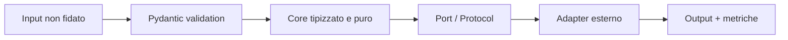

# 01 - Python production-grade

## Devi padroneggiare

- model di dominio, `dataclass`, Pydantic e validazione ai confini;
- typing: generics, `Protocol`, union discriminate, `mypy --strict`;
- iteratori, context manager, decorator e dependency injection;
- I/O asincrono, timeout, retry selettivi e concorrenza limitata;
- package, test unitari/integrativi, mocking ai confini;
- logging strutturato, configurazione e gestione degli errori.

**Inizia da qui:** [lezione Python passo-passo](LEZIONE.md).

**Dopo la lezione:** [approfondimento sui servizi AI affidabili](GUIDA.md).

## Schema



Il core non deve conoscere OpenAI, database o FastAPI. Dipende da interfacce; gli
adapter implementano le interfacce. Questo rende testabili retry, errori e fallback.

## Esempio: separare dominio e provider

```python
from typing import Protocol
from pydantic import BaseModel, Field

class Question(BaseModel):
    text: str = Field(min_length=3, max_length=2_000)

class Generator(Protocol):
    async def generate(self, question: str) -> str: ...

class AnswerService:
    def __init__(self, generator: Generator) -> None:
        self._generator = generator

    async def answer(self, question: Question) -> str:
        return await self._generator.generate(question.text)
```

Nel test usa un fake deterministico, non una chiamata reale:

```python
class FakeGenerator:
    async def generate(self, question: str) -> str:
        return f"answer:{question}"
```

## Concetti da saper spiegare

| Concetto | Risposta operativa |
|---|---|
| `asyncio` | utile per I/O; non accelera calcolo CPU-bound |
| Retry | solo errori transitori, con backoff, jitter e limite |
| Idempotenza | ripetere una richiesta non duplica effetti |
| Timeout | budget esplicito per ogni dipendenza |
| Backpressure | limita lavoro in ingresso quando il sistema è saturo |
| Type safety | elimina classi di errori prima del runtime |

## Esercizi

1. Implementa `AnswerService` con timeout di 3 secondi e massimo due retry solo per
   un'eccezione `TransientProviderError`.
2. Limita a cinque le chiamate concorrenti con `asyncio.Semaphore`.
3. Aggiungi un `request_id` ai log senza passarlo a ogni funzione.
4. Testa successo, timeout, errore permanente e cancellazione.
5. Crea una CLI che legga JSONL e produca JSONL, mantenendo l'ordine degli input.

**Vincoli:** niente `except Exception`, niente stato globale mutabile, nessun segreto
nel codice.

**Criterio di successo:** `pytest`, `ruff check .` e `mypy .` passano; un fake consente
di testare tutti i failure mode senza rete.

## Challenge da colloquio

Spiega perché aggiungere retry a ogni layer può moltiplicare le chiamate. Esempio:
tre layer con tre tentativi possono causare fino a `3 x 3 x 3 = 27` chiamate.
