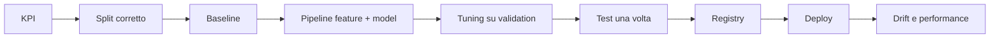

# 02 - Machine learning end-to-end

**Inizia da qui:** [primo sistema ML passo-passo](LEZIONE.md).

**Dopo la lezione:** [approfondimento su training, tuning e produzione](GUIDA.md).

## Dalla domanda al modello



## Teoria essenziale

### Split e leakage

- split casuale solo se i campioni sono indipendenti e identicamente distribuiti;
- split temporale per previsioni future;
- split per gruppo quando record dello stesso utente/cliente sono correlati;
- fit di scaler, imputazione e vocabolario **solo sul train**;
- il test set si usa una volta, dopo aver scelto modello e iperparametri.

### Metriche

| Caso | Metriche utili |
|---|---|
| Classi sbilanciate | precision, recall, PR-AUC |
| Costi diversi | threshold scelto su costo atteso |
| Ranking | MAP, MRR, NDCG |
| Regressione | MAE, RMSE, errore per segmento |
| Probabilità | log-loss, Brier score, calibrazione |

Non ottimizzare una media soltanto: misura per paese, device, fascia temporale e gruppi
critici. Confronta sempre con una baseline semplice.

### Tuning

Parti da modello lineare o albero. Usa cross-validation compatibile con i dati,
ricerca casuale o bayesiana, early stopping. Registra codice, dati, seed, parametri,
metriche e artefatto. Il tuning non corregge dati scadenti o leakage.

## Esempio: pipeline senza leakage

```python
from sklearn.compose import ColumnTransformer
from sklearn.impute import SimpleImputer
from sklearn.linear_model import LogisticRegression
from sklearn.pipeline import make_pipeline
from sklearn.preprocessing import OneHotEncoder, StandardScaler

preprocess = ColumnTransformer([
    ("num", make_pipeline(SimpleImputer(), StandardScaler()), ["age", "amount"]),
    ("cat", make_pipeline(
        SimpleImputer(strategy="most_frequent"),
        OneHotEncoder(handle_unknown="ignore"),
    ), ["country"]),
])
model = make_pipeline(preprocess, LogisticRegression(class_weight="balanced"))
model.fit(train_x, train_y)
```

## Esercizi

1. Costruisci un classificatore di churn con split temporale e baseline "classe più
   frequente".
2. Confronta regressione logistica e gradient boosting usando PR-AUC.
3. Scegli il threshold minimizzando `5 * FN + FP`; non usare il threshold di default.
4. Salva pipeline e metadati. Crea una API `/predict` che valida schema e versione.
5. Testa invarianti: colonne mancanti, categorie nuove, `NaN`, batch vuoto.
6. Simula data drift e calcola PSI o Jensen-Shannon divergence.

**Criterio di successo:** training riproducibile con un comando, nessun preprocessing
duplicato tra training e inference, metriche per segmento e rollback documentato.

## Failure mode da conoscere

- training-serving skew;
- target leakage;
- concept drift e data drift;
- feedback loop;
- distribuzione delle feature fuori range;
- modello accurato ma non calibrato;
- latenza o costo incompatibili con il prodotto.
