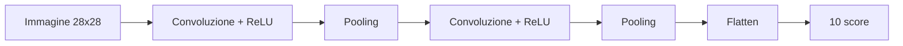

# Lezione passo-passo: creare un modello che riconosce immagini

## Cosa saprai fare alla fine

Saprai:

1. spiegare come un'immagine diventa un insieme di numeri;
2. distinguere classe, label, training e inference;
3. addestrare un classificatore di cifre scritte a mano;
4. confrontarlo con una baseline;
5. leggere accuracy, matrice di confusione ed esempi sbagliati;
6. spiegare neurone, layer, epoca, batch e funzione di perdita;
7. capire perché le CNN sono adatte alle immagini;
8. distinguere training da zero e transfer learning;
9. descrivere come portare un modello di visione fuori dal notebook.

## Cosa devi sapere prima

Completa:

- [Python passo-passo](../01-python-production/LEZIONE.md);
- [il primo sistema ML](../02-ml-production/LEZIONE.md).

Devi conoscere funzione, lista, dataset, feature, label, train/test, baseline e
accuracy. Questa lezione ricostruisce i concetti specifici delle immagini.

## 1. Il problema concreto

Vogliamo ricevere l'immagine di una cifra scritta a mano e restituire un numero da
0 a 9:

```text
immagine della cifra "7" -> modello -> classe 7
```

Questo è un problema di **classificazione di immagini**. Le classi possibili sono
note in anticipo. Altri esempi:

- foto di un prodotto → categoria;
- radiografia → presenza o assenza di un'anomalia;
- documento acquisito → fattura, contratto o ricevuta;
- componente industriale → difettoso o corretto.

Il modello non vede una “cifra” come noi. Riceve numeri.

## 2. Pixel, canali e tensori

Un'immagine digitale è una griglia di **pixel**. Ogni pixel contiene valori che
descrivono il colore.

Una piccola immagine in scala di grigi:

```text
0  0  2  9
0  1  8  3
0  7  4  0
```

`0` può rappresentare nero e un valore maggiore un punto più luminoso.

Le forme più comuni sono:

```text
scala di grigi: altezza x larghezza
RGB:            altezza x larghezza x 3 canali
batch RGB:      numero immagini x 3 x altezza x larghezza
```

RGB usa tre canali: rosso, verde e blu. Un **tensore** è un contenitore numerico con
una o più dimensioni. Un numero è un tensore a zero dimensioni, un vettore a una,
una matrice a due; un batch di immagini ne usa quattro.

File e librerie grafiche rappresentano spesso RGB come `H x W x C` (altezza,
larghezza, canali). PyTorch usa normalmente `C x H x W`; per questo `Conv2d` riceve
prima il numero di canali.

## 3. Dataset e label

Useremo `load_digits` di Scikit-learn. Contiene 1.797 immagini in scala di grigi,
ognuna di 8 × 8 pixel. In questo dataset didattico l'intensità dei pixel va da 0 a
16, non da 0 a 255.

```text
immagine 0 -> label 3
immagine 1 -> label 1
...
```

Ogni immagine ha quindi 64 valori. Nel primo modello li disponiamo in una riga:

```text
8 x 8 pixel -> 64 feature -> classificatore -> probabilità per 10 classi
```

Questa operazione si chiama **flatten**, cioè appiattimento. Nel programma la rendiamo
esplicita con `digits.images.reshape(len(digits.images), -1)`. È semplice, ma perde
l'informazione esplicita che due pixel erano vicini. Più avanti vedremo come una CNN
conserva la struttura spaziale.

## 4. Che cosa significa “creare un modello”

La frase può indicare attività diverse:

1. scegliere il problema, i dati e la metrica;
2. scegliere un'architettura, per esempio regressione logistica o CNN;
3. addestrare i parametri usando esempi;
4. valutare il risultato su dati mai usati per addestrare;
5. salvare e servire il modello.

Nel lavoro reale quasi mai si inventa una nuova architettura matematica. Spesso si
parte da un modello noto o pre-addestrato e lo si adatta al proprio problema.

## 5. Primo classificatore di immagini

Il file `examples\vision_basics.py`:

1. carica immagini e label;
2. separa training e test;
3. costruisce la baseline “predici sempre la cifra più frequente”;
4. standardizza i pixel;
5. addestra una regressione logistica multiclasse;
6. valuta gli errori.

Esegui dalla cartella `AI-Mastery-Accelerator`:

```powershell
python examples\vision_basics.py
```

Output atteso:

```text
Images: 1797
Image shape: 8 x 8 pixels
Training images: 1347
Test images: 450
Baseline accuracy: 0.102
Model accuracy:    0.978
Classification errors: 10
First error: expected=1, predicted=8
Confusion matrix:
[[45  0  0  0  0  0  0  0  0  0]
 [ 0 43  0  0  1  0  0  0  2  0]
 [ 0  0 44  0  0  0  0  0  0  0]
 [ 0  0  0 46  0  0  0  0  0  0]
 [ 0  0  0  0 45  0  0  0  0  0]
 [ 0  0  0  0  0 45  0  0  0  1]
 [ 0  0  0  0  0  0 44  0  1  0]
 [ 0  0  0  0  0  0  0 45  0  0]
 [ 0  3  0  0  0  0  0  0 40  0]
 [ 0  0  0  0  0  0  0  1  1 43]]
```

Il modello classifica correttamente circa il 97,8% delle immagini di test. La
baseline ottiene circa il 10,2% perché esistono dieci classi quasi bilanciate.

Non basta dire “97,8% è alto”. Devi chiedere:

- il test rappresenta immagini future?
- quali cifre vengono confuse?
- un errore ha lo stesso costo per tutte le classi?
- immagini reali hanno la stessa risoluzione e luminosità?

## 6. Dalla previsione agli errori

Una **matrice di confusione** ha:

- righe: classi vere;
- colonne: classi predette;
- diagonale: previsioni corrette;
- celle fuori diagonale: confusioni.

Per trovare esempi sbagliati:

```python
errors = np.flatnonzero(predictions != test_y)
for index in errors[:5]:
    print(
        f"atteso={test_y[index]}, "
        f"predetto={predictions[index]}"
    )
```

Il passo successivo non è cambiare casualmente modello. Visualizza gli errori e
classificali:

- cifra realmente ambigua;
- label sbagliata;
- immagine tagliata o rumorosa;
- trasformazione incoerente;
- classe poco rappresentata.

## 7. Preprocessing e data augmentation

Il **preprocessing** trasforma ogni immagine nello stesso modo prima del modello:

```text
lettura -> orientamento -> resize -> conversione canali -> normalizzazione
```

Training e inference devono usare la stessa trasformazione deterministica.

La **data augmentation** crea varianti plausibili durante il training, per esempio
piccole rotazioni, ritagli o cambi di luminosità. Non deve cambiare la label.

Una rotazione leggera di una scarpa resta una scarpa. Capovolgere una cifra `6` può
invece trasformarla in qualcosa simile a `9`: sarebbe un'augmentation pericolosa.

Applica augmentation solo al training set, mai a validation e test.

## 8. Rete neurale senza formule misteriose

Una **rete neurale** combina strati, chiamati **layer**:

```text
input -> trasformazione lineare -> attivazione -> ... -> score delle classi
```

Un **neurone** calcola una somma pesata degli input e applica una funzione. I pesi
sono parametri imparati.

Durante il training:

1. il modello produce score;
2. una **loss**, o funzione di perdita, misura l'errore;
3. la backpropagation calcola come ogni parametro ha contribuito;
4. l'optimizer modifica leggermente i parametri;
5. il processo si ripete.

Termini essenziali:

| Termine | Significato |
|---|---|
| batch | piccolo gruppo elaborato insieme |
| epoca | un passaggio sull'intero training set |
| learning rate | grandezza degli aggiornamenti |
| loss | errore ottimizzato durante il training |
| optimizer | regola che aggiorna i parametri |
| gradient | direzione locale in cui cambia la loss |

Più epoche non garantiscono un modello migliore: dopo un punto può iniziare
l'overfitting.

## 9. Perché usare una CNN

Una **CNN**, Convolutional Neural Network, usa filtri piccoli che scorrono
sull'immagine:

```text
pixel -> bordi -> forme semplici -> parti -> classe
```

Una convoluzione:

- guarda regioni locali;
- riusa lo stesso filtro in posizioni diverse;
- conserva relazioni spaziali;
- richiede meno parametri di un layer completamente connesso su immagini grandi.

Il **pooling** riduce altezza e larghezza, mantenendo segnali importanti. Alla fine
un classificatore converte le feature apprese in score per classe.

Schema:



## 10. CNN con PyTorch

PyTorch rappresenta tensori, layer, loss e optimizer. Installa il laboratorio
opzionale:

```powershell
pip install -e ".[vision]"
```

Il file `examples\vision_cnn.py` scarica Fashion-MNIST, un dataset di immagini
28 × 28 con dieci categorie di abbigliamento, e addestra una piccola CNN:

```powershell
python examples\vision_cnn.py
```

Il primo avvio scarica i dati e su CPU può richiedere alcuni minuti. Su Windows
l'installazione precedente è pensata per CPU. Per usare una GPU NVIDIA devi scegliere
il comando compatibile con driver e versione CUDA nel
[selettore ufficiale PyTorch](https://pytorch.org/get-started/locally/), poi verificare
che `torch.cuda.is_available()` restituisca `True`.

Output indicativo dopo tre epoche:

```text
Epoch 1: train_loss=0.5602, validation_accuracy=0.859
Epoch 2: train_loss=0.3629, validation_accuracy=0.877
Epoch 3: train_loss=0.3179, validation_accuracy=0.884
Final test accuracy: 0.882
Device: cpu
```

I valori possono cambiare per versione e hardware. La distinzione importante è che
la validation viene osservata durante lo sviluppo, mentre il test viene valutato una
sola volta alla fine.

Il cuore dell'architettura è:

```python
class SmallCNN(nn.Module):
    def __init__(self) -> None:
        super().__init__()
        self.features = nn.Sequential(
            nn.Conv2d(1, 16, kernel_size=3, padding=1),
            nn.ReLU(),
            nn.MaxPool2d(2),
            nn.Conv2d(16, 32, kernel_size=3, padding=1),
            nn.ReLU(),
            nn.MaxPool2d(2),
        )
        self.classifier = nn.Linear(32 * 7 * 7, 10)

    def forward(self, images: torch.Tensor) -> torch.Tensor:
        features = self.features(images)
        return self.classifier(features.flatten(start_dim=1))
```

`forward` descrive il percorso dall'immagine ai dieci score. Durante l'inference si
sceglie l'indice con score maggiore.

## 11. Training da zero e transfer learning

**Training da zero** inizializza i parametri casualmente. Richiede molti dati,
calcolo e tempo.

**Transfer learning** parte da un modello pre-addestrato, per esempio ResNet:

```text
milioni di immagini generiche
        -> modello pre-addestrato
        -> sostituzione ultimo layer
        -> fine-tuning sui tuoi esempi
```

Per un dataset aziendale piccolo è spesso la prima scelta:

1. carica i pesi ufficiali;
2. usa il preprocessing associato a quei pesi;
3. sostituisci la testa di classificazione;
4. congela inizialmente il backbone;
5. addestra la testa;
6. eventualmente sblocca gli ultimi layer con learning rate basso;
7. valuta su un test indipendente.

Non usare un modello pre-addestrato senza verificare licenza, dominio, bias e
prestazioni sulle tue immagini.

## 12. Dati e split nel mondo reale

Uno split casuale può mentire. Esempi di leakage:

- fotogrammi quasi identici dello stesso video in train e test;
- foto dello stesso paziente in entrambi;
- immagini duplicate con nomi diversi;
- watermark presente soltanto in una classe;
- sfondo che rivela la label.

Usa split per gruppo, soggetto, dispositivo, sede o tempo secondo il modo in cui il
modello verrà usato.

La qualità delle label va controllata: se due annotatori non concordano, il problema
potrebbe essere ambiguo anche per il modello.

## 13. Portare il modello in produzione

Il sistema completo non è soltanto il file dei pesi:

```text
upload
 -> validazione formato e dimensione
 -> decoder sicuro
 -> preprocessing versionato
 -> modello versionato
 -> probabilità e soglia
 -> risposta
 -> metriche e revisione
```

Devi definire:

- formati e dimensione massima;
- gestione di immagini corrotte;
- latenza e memoria;
- CPU o GPU;
- batching;
- versione del preprocessing;
- astensione per immagini fuori dominio;
- privacy e tempo di conservazione;
- monitoring di qualità e drift.

Per casi ad alto rischio, la previsione supporta una persona e non prende da sola una
decisione irreversibile.

## 14. Laboratorio guidato

1. Esegui `python examples\vision_basics.py`.
2. Confronta baseline e modello.
3. Nel file stampa i primi cinque errori.
4. Stampa una cifra come matrice con
   `print(test_x[errors[0]].reshape(8, 8))`.
5. Separa dal training set un validation set e non guardare più il test.
6. Sul validation set cambia `random_state`, poi riduci il training al 20%.
7. Scrivi una tabella con variante, validation accuracy, errori e spiegazione.
8. Solo dopo, installa `.[vision]` ed esegui la CNN opzionale.

Il laboratorio base è concluso quando sai spiegare perché il modello sbaglia almeno
due immagini, non soltanto quando compare un numero alto. Il test serve per la stima
finale, non per scegliere quale variante preferisci.

## 15. Esercizi

### Base

1. Stampa quante immagini esistono per ogni cifra.
2. Calcola l'accuracy separata per ogni classe.
3. Trova le due classi confuse più spesso.

### Intermedio

Confronta regressione logistica e `KNeighborsClassifier`. Usa lo stesso split e
misura accuracy e tempo di prediction.

### Avanzato

Usa transfer learning su un piccolo dataset organizzato in cartelle per classe.
Definisci augmentation, split per gruppo, metrica, criterio di early stopping e
condizione di rollback.

## 16. Soluzioni ragionate

### Base

Per contare le label:

```python
from collections import Counter

print(Counter(labels))
```

Per l'accuracy di ogni classe:

```python
for label in range(10):
    mask = test_y == label
    class_accuracy = (predictions[mask] == test_y[mask]).mean()
    print(label, round(float(class_accuracy), 3))
```

Le confusioni sono le celle fuori diagonale più grandi:

```python
error_matrix = matrix.copy()
np.fill_diagonal(error_matrix, 0)
flat_indexes = np.argsort(error_matrix, axis=None)[::-1]
for flat_index in flat_indexes[:2]:
    true_label, predicted_label = np.unravel_index(
        flat_index,
        error_matrix.shape,
    )
    print(true_label, "->", predicted_label, error_matrix[true_label, predicted_label])
```

### Intermedio

Sostituisci soltanto l'ultimo step della pipeline:

```python
from sklearn.neighbors import KNeighborsClassifier

knn = Pipeline(
    [
        ("scale", StandardScaler()),
        ("classifier", KNeighborsClassifier(n_neighbors=3)),
    ]
)
```

Addestra e valuta sullo stesso split. Non scegliere il vincitore solo per accuracy:
confronta anche memoria e latenza, perché KNN conserva il training set e calcola
distanze durante l'inference.

### Avanzato: criteri di verifica

Una soluzione valida documenta provenienza e licenza dei dati, impedisce che lo
stesso soggetto compaia in split diversi, conserva le trasformazioni associate ai
pesi, confronta una baseline, registra esperimenti e salva il checkpoint scelto
senza guardare il test. Il test viene usato una volta per la stima finale.

## 17. Errori comuni

- Addestrare e valutare sulle stesse immagini.
- Pensare che alta accuracy significhi sicurezza in ogni classe.
- Normalizzare training e produzione in modo diverso.
- Applicare augmentation anche al test.
- Lasciare duplicati o lo stesso soggetto in split diversi.
- Usare immagini reali sensibili senza consenso e regole di conservazione.
- Partire da una rete enorme senza baseline.
- Fine-tuning di tutti i layer con pochi dati e learning rate alto.
- Salvare soltanto i pesi, dimenticando classi e preprocessing.
- Trattare una probabilità alta come certezza.

## 18. Domande di autoverifica

**Che cosa riceve davvero un modello di immagini?**  
Tensori numerici che rappresentano pixel e canali.

**Perché la baseline vale circa il 10%?**  
Esistono dieci classi quasi bilanciate e predice sempre la più frequente.

**Che cosa mostra una matrice di confusione?**  
Quali classi vere vengono predette come quali altre classi.

**Perché una CNN è adatta alle immagini?**  
Usa filtri locali condivisi e conserva meglio la struttura spaziale.

**Che differenza c'è fra epoca e batch?**  
Un batch è un gruppo di esempi; un'epoca attraversa tutto il training set.

**Quando preferire transfer learning?**  
Quando hai meno dati o calcolo rispetto a quelli necessari per addestrare una rete
utile da zero.

**Che cos'è il leakage nelle immagini?**  
Informazione non disponibile o duplicata che permette risultati troppo ottimistici.

**Che cosa devi versionare oltre ai pesi?**  
Preprocessing, classi, soglie, codice, dipendenze e dati di valutazione.

## 19. Prossimo passo

Completa la [guida production-grade](GUIDA.md) per approfondire CNN, transfer
learning, esperimenti, deployment e monitoring. Poi continua con
[LLM e Transformer](../03-llm-foundations/LEZIONE.md): sono modelli diversi, ma
training, validazione, overfitting e serving riutilizzano molte idee.
