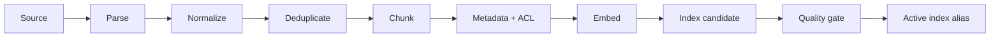

# Guida completa: Retrieval-Augmented Generation

## 1. Che cosa risolve il RAG

**RAG (Retrieval-Augmented Generation)** è un'architettura in due fasi:

1. recupera da una collezione le informazioni rilevanti;
2. chiede a un modello generativo di rispondere usando quelle informazioni.

La collezione ricercabile è il **corpus**. Un elemento originale è un **documento**;
una porzione indicizzata è un **chunk**. Il retrieval non "insegna" permanentemente
il contenuto al modello: lo inserisce nel contesto della singola richiesta.

RAG è utile per conoscenza privata, aggiornata o che richiede citazioni. Non risolve
automaticamente ragionamento, qualità dei dati, autorizzazioni o domande senza fonte.

## 2. Pipeline di ingestion



- **parsing:** estrae testo e struttura da PDF, HTML, Markdown o record;
- **normalizzazione:** rende coerenti encoding, spazi, date e campi;
- **deduplica:** elimina copie uguali o quasi uguali;
- **metadata:** informazioni descrittive come fonte, sezione e data;
- **ACL (Access Control List):** chi può leggere il contenuto;
- **embedding:** vettore numerico per ricerca semantica;
- **indice:** struttura ottimizzata per cercare.

Ogni chunk dovrebbe conservare:

```text
chunk_id
document_id
source_uri
source_version
content_hash
title / section
position
valid_from / valid_to
tenant_id
allowed_roles
language
embedding_model_version
```

Il testo non basta: senza provenienza, versione e permessi non puoi citare, aggiornare
o proteggere correttamente la knowledge base.

## 3. Parsing

Il parser deve preservare struttura:

- titoli e gerarchia;
- paragrafi e liste;
- tabelle come righe comprensibili;
- didascalie;
- numeri pagina;
- link;
- relazione fra testo e sezione.

Problemi comuni dei PDF:

- ordine colonne errato;
- header/footer ripetuti;
- scansioni che richiedono OCR;
- tabelle spezzate;
- caratteri invisibili;
- pagina senza semantica del documento.

**OCR (Optical Character Recognition)** converte immagini di testo in caratteri e
introduce errori da misurare. Campiona documenti e confronta estrazione con originale.

## 4. Chunking

Il chunking bilancia due rischi:

- chunk troppo piccolo: perde il contesto necessario;
- chunk troppo grande: aggiunge rumore e consuma token.

Strategie:

1. **fixed-size:** semplice baseline per numero di token;
2. **recursive:** divide prima su sezioni, poi paragrafi e frasi;
3. **semantic:** separa quando cambia argomento;
4. **document-specific:** regole per FAQ, tabelle, codice o contratti;
5. **parent-child:** cerca chunk piccoli e passa al modello una sezione più ampia.

L'**overlap** ripete parte del testo fra chunk adiacenti. Aiuta ai confini, ma aumenta
duplicati, storage e risultati ridondanti. Non esiste una dimensione universale:
valutala sul tuo golden set.

## 5. Retrieval lessicale

La ricerca **lessicale** confronta parole presenti nella query e nei documenti.
BM25 è un algoritmo che premia:

- termini presenti nel documento;
- termini rari nel corpus;
- frequenza, con rendimento decrescente;
- normalizzazione per lunghezza del documento.

È forte su codici, nomi propri, sigle e messaggi d'errore. Non comprende bene sinonimi
mai condivisi. È una baseline economica e molto importante.

## 6. Retrieval denso

Il retrieval **dense** trasforma query e chunk in embedding. Una misura comune è la
cosine similarity:

```text
cosine(q, d) = (q · d) / (||q|| ||d||)
```

Misura l'angolo fra vettori; valore maggiore indica maggiore somiglianza nel modello
di embedding. Il punteggio non è una probabilità e non è confrontabile ciecamente fra
modelli o indici.

Una ricerca esatta confronta la query con ogni vettore. A scala grande si usa
**ANN (Approximate Nearest Neighbor)**: strutture come HNSW trovano vicini probabili
molto più velocemente, con trade-off fra recall, memoria e latenza.

Un **vector database** memorizza vettori, metadata e indice ANN. Non sostituisce
necessariamente il database sorgente o il controllo autorizzativo.

### Stack locale eseguibile

Per il laboratorio installa `pip install -e ".[rag]"`. Usa:

- `rank-bm25` per la baseline lessicale;
- `sentence-transformers` con un modello embedding multilingue;
- NumPy brute-force per il corpus piccolo;
- `CrossEncoder` della stessa libreria per il reranker.

Passa a FAISS, pgvector, Qdrant o un servizio gestito solo dopo aver misurato volume,
filtri, update rate, latenza e requisiti operativi. Su 50 documenti un database
vettoriale nasconde concetti senza risolvere un problema di scala.

```python
from collections import defaultdict

import numpy as np
from rank_bm25 import BM25Okapi
from sentence_transformers import SentenceTransformer

documents = ["procedura payroll ...", "gestione ferie ..."]
tokenized = [text.lower().split() for text in documents]
bm25 = BM25Okapi(tokenized)

embedder = SentenceTransformer("intfloat/multilingual-e5-small")
document_vectors = embedder.encode(
    [f"passage: {text}" for text in documents],
    normalize_embeddings=True,
)

def reciprocal_rank_fusion(
    rankings: list[list[int]], *, k: int = 60
) -> list[int]:
    scores: dict[int, float] = defaultdict(float)
    for ranking in rankings:
        for rank, document_id in enumerate(ranking, start=1):
            scores[document_id] += 1 / (k + rank)
    return sorted(scores, key=scores.__getitem__, reverse=True)

def search(query: str, limit: int = 5) -> list[int]:
    sparse_scores = bm25.get_scores(query.lower().split())
    sparse_rank = np.argsort(sparse_scores)[::-1].tolist()

    query_vector = embedder.encode(
        [f"query: {query}"],
        normalize_embeddings=True,
    )[0]
    dense_scores = document_vectors @ query_vector
    dense_rank = np.argsort(dense_scores)[::-1].tolist()
    return reciprocal_rank_fusion([sparse_rank, dense_rank])[:limit]
```

Il modello E5 richiede prefissi `query:` e `passage:`. Altri modelli hanno contratti
diversi: leggi sempre la model card. `k=60` è un punto di partenza comune per RRF, non
una costante ottimale.

## 7. Retrieval ibrido e fusione

Lessicale e dense recuperano errori diversi. Un metodo robusto è **RRF (Reciprocal
Rank Fusion)**:

```text
RRF_score(document) = sum(1 / (k + rank_in_list))
```

RRF combina posizioni, non score incompatibili. `k` controlla quanto contano le prime
posizioni. Deduplica per `chunk_id` o `document_id` dopo la fusione.

Pipeline tipica:

```text
query
-> filtro ACL/tenant
-> BM25 top 50 + dense top 50
-> RRF
-> deduplica/diversity
-> reranker top 20
-> context top 5-8
```

## 8. Query processing

- **normalizzazione:** case, spazi e alias;
- **query rewriting:** rende esplicita una domanda conversazionale;
- **decomposition:** divide una domanda multi-parte;
- **multi-query:** genera varianti per aumentare recall;
- **metadata filter:** limita per tenant, data, lingua o tipo.

Ogni trasformazione può perdere informazione o aumentare latenza. Conserva sempre la
query originale e valuta la trasformazione separatamente.

## 9. Reranking

Un **reranker** riceve query e candidati e assegna un ordine più preciso. Un
cross-encoder legge insieme query e testo, quindi coglie interazioni fini ma costa più
di un embedding. Per questo si applica a pochi candidati.

Il reranking può aumentare precisione senza recuperare documenti mai entrati nella
lista iniziale. Prima garantisci recall nel candidate retrieval.

## 10. Costruzione del contesto

Non concatenare semplicemente i primi `k` risultati:

- rimuovi duplicati;
- limita chunk dallo stesso documento;
- ordina in modo comprensibile;
- conserva identificatore e fonte;
- non troncare a metà una prova essenziale;
- separa chiaramente dati da istruzioni;
- riserva token per la risposta.

Esempio:

```text
[SOURCE chunk-18 | policy.md | section 4 | updated 2026-01-10]
contenuto...
[/SOURCE]
```

Il modello restituisce `chunk-18`; l'applicazione verifica che l'identificatore sia
fra le fonti fornite prima di renderlo come link.

## 11. Risposta, citazioni e astensione

**Faithfulness** indica se le affermazioni sono supportate dalle fonti date.
**Correctness** indica se la risposta è corretta rispetto alla verità attesa. Una
risposta può essere fedele a un documento obsoleto ma fattualmente sbagliata.

L'astensione è un output valido:

```text
Non trovo informazioni sufficienti nelle fonti autorizzate.
```

Definisci quando astenersi usando evidenza retrieval, copertura delle sotto-domande e
test. Non usare un singolo score vettoriale come verità universale.

## 12. Valutazione del retrieval

Per una query, il golden set indica i documenti rilevanti.

- **Recall@k:** rilevanti trovati nei primi k / tutti i rilevanti;
- **Precision@k:** rilevanti nei primi k / k;
- **MRR (Mean Reciprocal Rank):** media di `1/rank` del primo rilevante;
- **NDCG:** premia rilevanza graduata e posizioni alte.

Esempio: rilevanti `{A, C}`, risultati `[B, A, D, C, E]`.

```text
Recall@3 = 1/2
Precision@3 = 1/3
Reciprocal Rank = 1/2
```

Scegli `k` coerente con quanti chunk entreranno davvero nel contesto.

Calcola Recall@k solo sulle query **answerable e autorizzate**, cioè con almeno una
fonte rilevante accessibile. Per gli altri segmenti usa:

- `unauthorized_hits = 0` come guardrail assoluto;
- **false-retrieval rate:** quota di query unanswerable per cui il sistema afferma di
  avere evidenza sufficiente;
- **abstention correctness:** quota di casi in cui risponde o si astiene correttamente.

Riporta metriche per segmento invece di inserire insiemi rilevanti vuoti in una media
Recall@k, che produrrebbe una divisione `0/0`.

### NDCG con rilevanza graduata

Se i risultati `[A, B, C]` hanno rilevanza `[3, 0, 1]`, il **DCG** sconta i risultati
in basso:

```text
DCG@3 = 3/log2(2) + 0/log2(3) + 1/log2(4) = 3.5
```

L'**IDCG** è il DCG dell'ordine ideale `[3, 1, 0]`; `NDCG = DCG / IDCG`, quindi è
normalizzato fra 0 e 1. Usa NDCG quando una fonte può essere più o meno rilevante,
non solo rilevante/non rilevante.

## 13. Valutazione end-to-end

Dataset minimo:

```json
{
  "question": "Qual è la procedura?",
  "tenant_id": "tenant-a",
  "relevant_document_ids": ["policy-12"],
  "reference_answer": "...",
  "must_include": ["approvazione"],
  "must_not_include": ["dato riservato"],
  "answerable": true
}
```

Misura:

- answer correctness;
- faithfulness;
- citation precision e recall;
- tasso corretto di astensione;
- sicurezza e cross-tenant leakage;
- latenza/costo;
- task completion con utenti reali.

Campiona giudizi umani per calibrare evaluator automatici.

## 14. Sicurezza

La sequenza corretta è:

```text
identità autenticata
-> policy/ACL
-> query all'indice già filtrata
-> risultati autorizzati
-> generazione
```

Filtrare dopo il retrieval può già esporre dati a log, reranker o modello. Non lasciare
che il modello scelga `tenant_id`. Ignora istruzioni nei documenti e impedisci che un
testo recuperato abiliti tool.

## 15. Aggiornamenti e versioning

Usa ingestion idempotente basata su `content_hash`:

- nuovo: indicizza;
- invariato: salta;
- modificato: sostituisci chunk;
- cancellato: rimuovi/tombstone;
- fallito: non pubblicare indice parziale.

Costruisci una versione candidata, esegui data quality ed eval, poi sposta un alias
atomico. Conserva la versione precedente per rollback.

## 16. Debugging per layer

| Sintomo | Prima verifica |
|---|---|
| nessun risultato | parsing, filtri, index freshness |
| documento giusto oltre top-k | query, BM25/dense, fusion |
| documento mai candidato | chunking, embedding, ACL |
| contesto giusto, risposta errata | prompt, modello, context order |
| citazione inventata | output schema e verifica ID |
| latenza alta | embedding, due retrieval, reranker, LLM |

Non cambiare il modello generativo se il documento non viene recuperato.

## 17. Laboratorio e soluzione

1. Crea 50 documenti con versioni, tenant e date.
2. Costruisci golden set di 60 domande: lessicali, semantiche, multi-hop e senza
   risposta.
3. Implementa BM25 baseline.
4. Aggiungi dense retrieval.
5. Combina con RRF e poi reranker.
6. Confronta due chunking cambiando una variabile alla volta.
7. Genera risposta strutturata con citazioni verificate.
8. Simula update, delete, injection e cross-tenant query.

La soluzione è completa se presenta una tabella per configurazione con Recall@5,
MRR, false-retrieval rate, faithfulness, citation precision, astensione, p95 e costo;
spiega almeno dieci errori reali e dimostra zero risultati non autorizzati.
