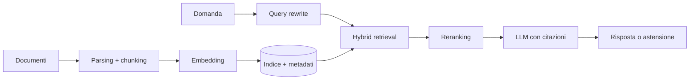

# 04 - Retrieval-Augmented Generation

**Inizia da qui:** [RAG passo-passo](LEZIONE.md).

**Dopo la lezione:** [approfondimento su RAG in produzione](GUIDA.md).

## Architettura



Il RAG ha almeno due sistemi da valutare separatamente:

1. **retrieval**: ha recuperato evidenza rilevante?
2. **generation**: la risposta è fedele all'evidenza?

## Decisioni fondamentali

### Parsing e chunking

Chunk per struttura semantica, non solo ogni N caratteri. Conserva titolo, sezione,
fonte, timestamp, permessi e posizione. Overlap e chunk enormi possono aumentare
rumore e costo.

### Retrieval

- dense retrieval cattura similarità semantica;
- BM25 cattura parole esatte, codici e nomi;
- hybrid combina i due ranking;
- reranker migliora precisione sui candidati;
- filtri metadata applicano tenant, permessi, lingua e validità temporale.

### Risposta

Il modello deve citare chunk identificabili, distinguere evidenza da inferenza e
astenersi quando il contesto è insufficiente. Le autorizzazioni si applicano prima
del retrieval, non nel prompt.

## Esempio di contratto

```python
from dataclasses import dataclass
from typing import Protocol

@dataclass(frozen=True)
class Document:
    id: str
    text: str
    source: str
    score: float

class Retriever(Protocol):
    async def search(
        self, query: str, *, tenant_id: str, limit: int = 8
    ) -> list[Document]: ...
```

La funzione RAG dipende da `Retriever`, non da un database vettoriale specifico.

## Metriche

| Layer | Metriche |
|---|---|
| Retrieval | Recall@k, Precision@k, MRR, NDCG |
| Generation | faithfulness, correctness, citation precision/recall |
| Sistema | answer rate, latency p95, costo/query, error rate |
| Prodotto | task completion, escalation, feedback corretto |

Costruisci un golden set con domanda, fonti rilevanti, risposta attesa e casi senza
risposta. La "LLM-as-judge" aiuta, ma va calibrata su giudizi umani.

## Laboratorio

Costruisci un assistente su 20-50 documenti tecnici.

1. Ingestion idempotente con hash, metadati e versionamento.
2. Due strategie di chunking.
3. BM25 come baseline, dense e hybrid come candidati.
4. Golden set di almeno 40 domande, 10 delle quali senza risposta.
5. Confronto Recall@5, faithfulness, p95 e costo.
6. Citazioni verificabili e astensione esplicita.
7. Test di prompt injection contenuta nei documenti.
8. Filtro obbligatorio per `tenant_id`.

**Esperimento minimo:** cambia una sola variabile alla volta e salva configurazione e
metriche. Non scegliere la pipeline guardando esempi manuali.

**Criterio di successo:** Recall@5 >= 0,85 sulle query answerable/autorizzate, zero
risultati non autorizzati e ogni affermazione fattuale contiene una citazione valida
oppure il sistema si astiene. Misura separatamente i casi senza risposta.

## Failure mode

Chunk errato, documento non parsato, embedding mismatch, filtri mancanti, query
ambigua, retrieval rumoroso, contesto perso nel mezzo, citazione inventata, indice
stale, injection dal documento e autorizzazione applicata troppo tardi.
