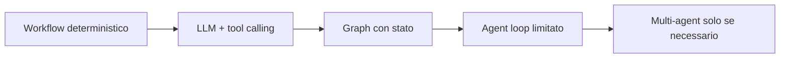
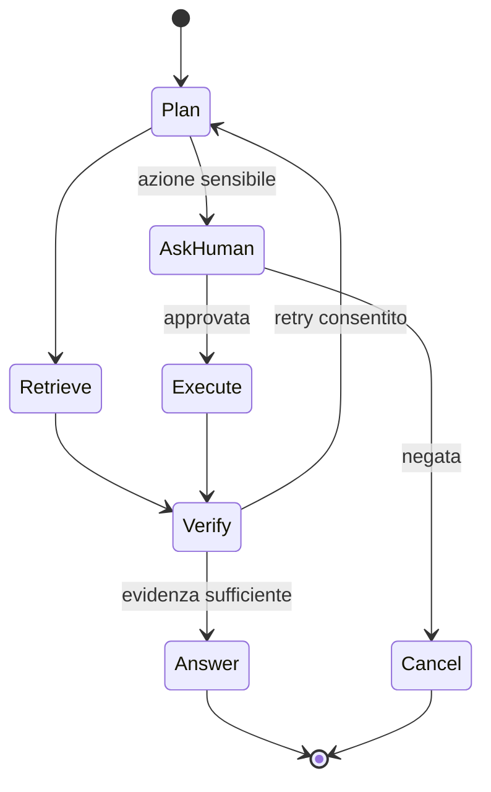

# 05 - Agenti, LangChain e LangGraph

**Inizia da qui:** [workflow e agenti passo-passo](LEZIONE.md).

**Dopo la lezione:** [approfondimento su LangGraph](GUIDA.md).

## Prima regola

Non usare un agente se una pipeline deterministica basta. Un agente è utile quando il
modello deve scegliere dinamicamente strumenti o passi; introduce costo, variabilità
e nuovi failure mode.

## Dal semplice al complesso



LangChain offre componenti e integrazioni. LangGraph modella workflow stateful come
grafo: nodi, archi, branching, checkpoint e human-in-the-loop. Impara le astrazioni,
ma mantieni dominio e contratti indipendenti dal framework.

## Componenti di un agente affidabile

- obiettivo e condizione di stop;
- stato tipizzato;
- tool piccoli, descrizioni precise e input validati;
- autorizzazione separata dalla decisione del modello;
- massimo numero di passi, timeout e budget;
- idempotency key per tool con effetti;
- checkpoint e recovery;
- approval umano prima di azioni irreversibili;
- trace completo senza dati sensibili.

## Schema LangGraph



## Esempio di stato e tool

```python
from typing import Annotated, Literal, TypedDict
from pydantic import BaseModel, Field

class AgentState(TypedDict):
    request_id: str
    question: str
    steps: int
    status: Literal["working", "waiting_approval", "done", "failed"]

class SearchInput(BaseModel):
    query: str = Field(min_length=2, max_length=500)
    limit: int = Field(default=5, ge=1, le=10)
```

Non dare al tool parametri come `tenant_id`, ruolo o account scelti liberamente dal
modello: iniettali dal contesto autenticato.

## Esercizi

1. Implementa un agente di supporto che può cercare documenti e aprire un ticket.
2. Rendi la ricerca read-only; richiedi approval prima di creare il ticket.
3. Limita a sei passi, 20 secondi e un budget configurabile.
4. Aggiungi checkpoint: dopo un crash il ticket non deve essere creato due volte.
5. Testa tool inesistente, argomenti invalidi, loop, timeout, rifiuto umano e provider
   indisponibile.
6. Confronta il graph con una pipeline deterministica usando successo, costo e p95.

**Criterio di successo:** nessuna azione sensibile senza controllo applicativo,
replay sicuro, trace leggibile e successo misurato su almeno 30 scenari.

## Domande da colloquio

- Quando preferiresti un workflow a un agente?
- Come impedisci che il modello elevi i propri permessi?
- Come gestisci tool non idempotenti?
- Come testi una traiettoria non deterministica?
- Quando un multi-agent è complessità senza valore?
