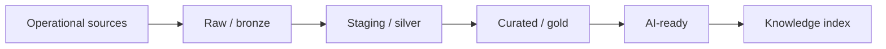

# Guida completa: data platform per AI e MCP

## 1. Lessico della data platform

- **data source:** sistema che produce dati, per esempio API HR o database payroll;
- **ingestion:** copia affidabile dei dati dalla fonte a una destinazione;
- **ETL:** Extract, Transform, Load; trasforma prima del caricamento;
- **ELT:** Extract, Load, Transform; carica raw e trasforma nel warehouse;
- **data warehouse:** database analitico ottimizzato per query su grandi volumi;
- **data lake:** storage di file strutturati e non strutturati;
- **schema:** nomi, tipi, vincoli e relazioni dei campi;
- **lineage:** tracciamento di origine e trasformazioni;
- **orchestrazione:** pianificazione e coordinamento di task e dipendenze;
- **data product:** dataset con owner, contratto, qualità, documentazione e SLO.

In questo stack, dlt esegue ingestion, Snowflake conserva e calcola, dbt trasforma e
testa, Airflow orchestra. Confondere i ruoli produce DAG enormi e logica duplicata.

## 2. OLTP e OLAP

**OLTP (Online Transaction Processing)** serve transazioni applicative brevi:
creare dipendente, aggiornare contratto. **OLAP (Online Analytical Processing)** serve
analisi su molte righe e aggregazioni. Snowflake è principalmente OLAP.

Non caricare query analitiche pesanti direttamente sul database del prodotto: possono
competere con utenti e creare coupling.

## 3. Architettura a layer



- **raw/bronze:** copia fedele, auditabile e append-only quando possibile;
- **staging/silver:** tipi e nomi normalizzati, deduplica tecnica;
- **curated/gold:** concetti di business e relazioni;
- **AI-ready:** testo, metadata, ACL, qualità e versione per ingestion AI.

Non è obbligatorio usare questi nomi, ma devono essere chiari confini e owner.

## 4. dlt: ingestion

La libreria **dlt (data load tool)** estrae dati Python, gestisce schema e carica verso
una destination.

```python
import dlt
from collections.abc import Iterator

@dlt.resource(
    name="policies",
    primary_key="id",
    write_disposition="merge",
)
def policies(
    updated_at=dlt.sources.incremental(
        "updated_at",
        initial_value="2026-01-01T00:00:00Z",
        last_value_func=max,
        lag=300.0,
    ),
) -> Iterator[dict[str, object]]:
    next_url: str | None = (
        "https://example.invalid/policies"
        f"?updated_after={updated_at.last_value}"
    )
    while next_url:
        response = authorized_get(next_url, timeout=10)
        response.raise_for_status()
        payload = response.json()
        yield from payload["items"]
        next_url = payload.get("next")

pipeline = dlt.pipeline(
    pipeline_name="hr_policies",
    destination="duckdb",
    dataset_name="raw_hr",
)
load_info = pipeline.run(policies())
```

Concetti:

- **primary key:** identifica un record;
- **write disposition append:** aggiunge righe;
- **replace:** sostituisce dati;
- **merge/upsert:** aggiorna record esistenti e inserisce nuovi;
- **cursor incrementale:** campo come `updated_at` usato per leggere solo novità;
- **schema evolution:** gestione di colonne nuove o tipi cambiati.

Un cursor può perdere record con timestamp uguale o aggiornamenti tardivi. Usa una
finestra sovrapposta e deduplica. Definisci anche come ricevere cancellazioni: evento,
campo `deleted_at`, snapshot diff o tombstone.

`dlt.sources.incremental` conserva il cursore nello stato della pipeline. `lag=300`
rilegge una finestra di cinque minuti; il merge su primary key rimuove i duplicati.
Lo stato avanza quando il load package viene committato: una pagina fallita prima del
commit non deve perdere il punto da cui ripartire. Verifica questa semantica con un
integration test sulla versione dlt usata.

## 5. Idempotenza e backfill

Una pipeline è **idempotente** se rieseguirla con lo stesso input produce lo stesso
stato logico. Serve perché retry e backfill sono normali.

Un **backfill** ricalcola un intervallo storico, per esempio dopo una correzione.

Regole:

- partizioni o finestre esplicite;
- upsert atomico su chiave stabile;
- niente timestamp `now()` come identità;
- side effect separati dal calcolo;
- checkpoint solo dopo commit;
- deduplica deterministica;
- input e versione codice registrati.

## 6. Snowflake

Snowflake separa:

- **storage:** dati compressi in micro-partizioni;
- **compute:** virtual warehouse che esegue query;
- **cloud services:** metadata, ottimizzazione, sicurezza e transazioni.

Un **virtual warehouse** non è un database: è il cluster di calcolo. Warehouse
separati isolano ingestion, trasformazioni e BI; auto-suspend riduce costo.

Concetti:

- database → schema → table/view;
- ruolo e grant per access control;
- micro-partition pruning per leggere meno dati;
- clustering key solo quando il pruning naturale non basta;
- Time Travel per recuperare versioni entro retention;
- zero-copy clone per ambienti/test senza duplicazione immediata.

Applica least privilege:

```text
role_ingest: write raw
role_transform: read raw, write curated
role_ai_indexer: read solo ai_documents autorizzati
role_bi: read mart aggregati
```

Evita un'unica credenziale `ACCOUNTADMIN`.

## 7. dbt

**dbt (data build tool)** trasforma dati nel warehouse con SQL versionato.

Un **model** è una query `select` materializzata come:

- `view`: query salvata, calcolata alla lettura;
- `table`: risultato fisico ricostruito;
- `incremental`: aggiorna solo parte del risultato;
- `ephemeral`: query incorporata in modelli downstream.

### Sources e staging

```sql
-- models/staging/stg_policies.sql
select
    cast(id as varchar) as policy_id,
    trim(title) as title,
    body,
    cast(updated_at as timestamp_tz) as updated_at,
    tenant_id,
    deleted_at
from {{ source('raw_hr', 'policies') }}
```

### Test

```yaml
version: 2
models:
  - name: ai_policies
    columns:
      - name: policy_id
        data_tests: [not_null, unique]
      - name: tenant_id
        data_tests: [not_null]
```

- test generico: not null, unique, relationship, accepted values;
- test singolare: query custom che restituisce righe invalide;
- source freshness: ritardo fra fonte e warehouse;
- contract: nomi/tipi richiesti dal consumer.

Un test fallito deve impedire la pubblicazione dell'indice, non necessariamente
cancellare il raw load utile al debugging.

### Snapshot

Uno snapshot conserva cambiamenti storici lentamente variabili, per esempio versioni
di una policy. Non sostituisce la source-of-truth, ma consente audit temporale.

## 8. Airflow

Airflow definisce un **DAG (Directed Acyclic Graph)**: grafo orientato senza cicli di
task e dipendenze.

- **task:** unità schedulabile;
- **operator:** template di task;
- **sensor:** attende una condizione;
- **scheduler:** crea task instance;
- **executor:** decide dove eseguirle;
- **XCom:** piccoli metadata fra task, non grandi dataset;
- **pool:** limita concorrenza su una risorsa;
- **retry:** nuova esecuzione dopo errore transitorio;
- **catchup:** crea run per intervalli passati.

```python
from airflow.decorators import dag, task
from pendulum import datetime

@dag(
    schedule="@hourly",
    start_date=datetime(2026, 1, 1, tz="UTC"),
    catchup=False,
    max_active_runs=1,
)
def knowledge_refresh():
    @task(retries=2)
    def extract(interval_start: str, interval_end: str) -> str:
        return run_dlt(interval_start, interval_end)

    @task
    def quality_gate(load_id: str) -> str:
        return run_dbt_and_tests(load_id)

    @task
    def publish(dataset_version: str) -> None:
        promote_index(dataset_version)

    publish(quality_gate(extract("{{ data_interval_start }}", "{{ data_interval_end }}")))

knowledge_refresh()
```

La business logic resta in package testabili; il DAG passa identificatori e
coordinate il lavoro. Ogni task deve poter ripartire.

## 9. Pipeline knowledge-base

```text
dlt load raw
-> dbt source freshness
-> dbt build ai_documents
-> data quality gate
-> diff su content_hash
-> parse/chunk/embed cambiati
-> candidate index
-> retrieval + safety eval
-> promote alias
-> dashboard e audit
```

Versiona indipendentemente:

- source snapshot;
- trasformazione dbt;
- parser/chunker;
- embedding model;
- vector index;
- eval dataset.

Un alias come `knowledge_active` punta alla versione approvata. Il rollback cambia
alias, non rigenera tutto durante un incidente.

## 10. MCP: problema e architettura

**MCP (Model Context Protocol)** standardizza come un'applicazione AI scopre e usa
contesto e capacità esposte da server.

Ruoli:

- **host:** applicazione che coordina uno o più client;
- **client:** mantiene una sessione con un server;
- **server:** espone primitive MCP;
- **resource:** dato leggibile identificato da URI;
- **tool:** funzione invocabile con schema;
- **prompt:** template dichiarato dal server.

Il protocollo usa messaggi **JSON-RPC**, cioè richieste con identificatore, metodo e
parametri, più risposte o notifiche.

## 11. Lifecycle e transport MCP

Lifecycle semplificato:

```text
connect
-> initialize (versione e capability)
-> initialized notification
-> list resources/tools/prompts
-> read/call/get
-> progress/log/cancel
-> close
```

La **capability negotiation** comunica funzioni supportate da entrambe le parti.

Transport comuni:

- **stdio:** host avvia processo locale e comunica su standard input/output;
- **Streamable HTTP:** server remoto su HTTP con sessione/streaming.

Stdio è semplice per tool locali; HTTP richiede autenticazione, TLS, limiti e gestione
sessioni. Non scrivere log liberi su stdout in un server stdio: corrompono il protocollo.

## 12. Progettare resource e tool MCP

Resource:

```text
hr-policy://tenant-a/policy-123/version/7
```

Tool:

```python
from mcp.server.fastmcp import FastMCP
from pydantic import Field

mcp = FastMCP("hr-knowledge")

@mcp.tool()
async def search_policies(
    query: str = Field(min_length=3, max_length=300),
    limit: int = Field(default=5, ge=1, le=10),
) -> list[dict[str, str]]:
    """Return policy excerpts visible to the authenticated principal."""
    principal = current_authenticated_principal()
    return await repository.search(
        query=query,
        tenant_id=principal.tenant_id,
        roles=principal.roles,
        limit=limit,
    )
```

Il modello non passa `tenant_id` perché potrebbe alterarlo. Descrizione e schema
devono spiegare quando il tool è valido e quali errori strutturati restituisce.

## 13. Sicurezza MCP

MCP è un protocollo, non una sandbox.

- autentica client/server;
- autorizza ogni resource e tool;
- valida URI e input;
- allowlist dei server;
- proteggi da DNS rebinding e richieste verso host arbitrari;
- conferma azioni sensibili;
- limita output, tempo e chiamate;
- non inoltrare token al modello;
- audit con identità, tool, parametri redatti e risultato;
- tratta resource e tool output come dati non fidati.

Per OAuth, il token rappresenta scope e audience precisi. Non riutilizzare un token
destinato a un servizio verso un altro server.

### Dove nasce il Principal

Il modo corretto dipende dal transport:

| Deployment | Identità | Uso corretto |
|---|---|---|
| stdio locale | processo/utente che avvia il server | tool personali, singolo trust boundary |
| Streamable HTTP | access token validato per richiesta | servizio remoto multi-utente/tenant |

Con **stdio**, il protocollo viaggia fra host e processo figlio. Non esiste
automaticamente un utente diverso per ogni tool call: il principal è normalmente
l'utente locale che ha avviato il processo. Dichiarare questo server multi-tenant
senza un ulteriore protocollo autenticato è errato.

Con **Streamable HTTP**, un middleware valida prima di MCP:

1. firma del token;
2. issuer, cioè chi lo ha emesso;
3. audience, cioè il servizio destinatario;
4. scadenza e not-before;
5. scope/ruoli;
6. tenant consentito.

Poi costruisce un `Principal` immutabile e lo inserisce nel request context async:

```python
from contextvars import ContextVar
from dataclasses import dataclass

@dataclass(frozen=True)
class Principal:
    subject: str
    tenant_id: str
    scopes: frozenset[str]

current_principal: ContextVar[Principal] = ContextVar("current_principal")

async def authentication_middleware(request, call_next):
    claims = verify_access_token(
        request.headers["Authorization"],
        expected_issuer=EXPECTED_ISSUER,
        expected_audience="hr-mcp-server",
    )
    reset_token = current_principal.set(principal_from_claims(claims))
    try:
        return await call_next(request)
    finally:
        current_principal.reset(reset_token)
```

Il tool legge questo contesto; non accetta identità dal modello. Un `ContextVar` evita
che richieste async concorrenti condividano il principal, ma l'implementazione reale
va collegata al middleware/contesto previsto dall'SDK MCP usato.

Non inoltrare ciecamente lo stesso bearer token a un servizio downstream. Usa token
con audience specifica, token exchange/on-behalf-of oppure una service identity con
policy che preservi tenant e audit. Il capstone multi-tenant usa Streamable HTTP
autenticato; la variante stdio è solo sviluppo single-user.

## 14. Docker

Un'immagine multi-stage installa il package dal `pyproject.toml`:

```dockerfile
FROM python:3.12-slim AS builder
RUN python -m venv /opt/venv
ENV PATH="/opt/venv/bin:$PATH"
WORKDIR /build
COPY pyproject.toml .
COPY src/ src/
RUN pip install --no-cache-dir .

FROM python:3.12-slim AS runtime
RUN useradd --create-home --uid 10001 appuser
COPY --from=builder /opt/venv /opt/venv
ENV PATH="/opt/venv/bin:$PATH"
USER appuser
EXPOSE 8080
CMD ["uvicorn", "ai_ops.api.app:app", "--host", "0.0.0.0", "--port", "8080"]
```

Fissa versioni/digest base, esegui scan vulnerabilità, usa filesystem read-only,
health check e secret montati a runtime. Non incorporare `.env`. Il modulo
`ai_ops.api.app` è quello creato nel capstone, non fa parte del package didattico base.

## 15. AWS

Percorso minimo:

- **ECR:** registry immagini;
- **ECS/Fargate:** container senza gestire nodi;
- **S3:** file raw e artefatti;
- **Secrets Manager:** segreti con IAM;
- **CloudWatch:** log e metriche;
- **IAM role:** permessi temporanei per workload;
- **VPC/security group:** isolamento di rete.

**IAM (Identity and Access Management)** definisce identità e policy. Un task role
consente al container accessi precisi senza chiavi statiche.

## 16. Metabase

Metabase interroga il warehouse per dashboard. Crea viste o mart stabili, non query
dirette su raw. Dashboard utili:

- source freshness;
- record invalidi/scartati;
- lag di indicizzazione;
- distribuzione versioni;
- qualità eval;
- token/costo per tenant;
- errori e astensioni.

## 17. Laboratorio e soluzione

Costruisci la pipeline su DuckDB, poi documenta il passaggio Snowflake:

1. API mock paginata con update/delete;
2. ingestion dlt incrementale;
3. modelli dbt raw→staging→AI-ready;
4. test e contract;
5. DAG Airflow idempotente con backfill;
6. index candidate e eval gate;
7. server MCP stdio locale e HTTP autenticato;
8. container non-root;
9. design AWS e dashboard Metabase.

La soluzione è corretta se:

- un retry non duplica dati;
- update tardivo e delete si propagano;
- dbt test fallito blocca solo la promozione;
- backfill non dipende dall'ora corrente;
- MCP non accetta tenant dal modello;
- tool di scrittura richiede approval e idempotency key;
- indice precedente resta disponibile;
- ruoli Snowflake e IAM rispettano least privilege.
