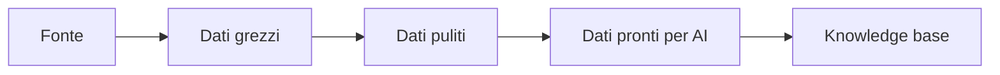
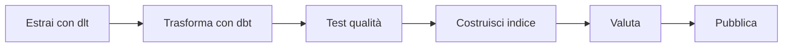

# Lezione passo-passo: dai dati grezzi a una knowledge base collegata con MCP

## Cosa saprai fare alla fine

Saprai:

1. spiegare perché serve una pipeline dati;
2. distinguere fonte, dati grezzi, dati puliti e dati pronti per AI;
3. capire che cosa fanno dlt, Snowflake, dbt e Airflow;
4. progettare un aggiornamento incrementale e idempotente;
5. spiegare host, client, server, resource e tool MCP;
6. capire dove applicare identità e permessi;
7. disegnare una pipeline che aggiorna una knowledge base senza lavoro manuale.

## Cosa devi sapere prima

Completa almeno:

- [Python passo-passo](../01-python-production/LEZIONE.md);
- [RAG passo-passo](../04-rag/LEZIONE.md);
- [Agenti passo-passo](../05-agents/LEZIONE.md).

## 1. Il problema concreto

Un'azienda conserva procedure HR in più posti:

- file Markdown;
- PDF;
- API del prodotto;
- database;
- strumenti SaaS.

Un sistema RAG deve trovare le versioni corrette e aggiornate. Copiare manualmente i
file una volta non basta:

```text
la fonte cambia -> l'indice resta vecchio -> l'agente risponde con dati obsoleti
```

Serve una **pipeline dati**: una sequenza automatizzata che acquisisce, controlla,
trasforma e pubblica dati.

## 2. Fonte e destinazione

La **fonte**, o source, è il sistema da cui arriva il dato. La **destinazione** è dove
lo copiamo per elaborarlo.

Esempio:

```text
API procedure HR -> data warehouse -> indice RAG
```

Il sistema sorgente resta la **source of truth**, cioè il riferimento autorevole. Il
warehouse e l'indice sono copie costruite per altri scopi.

Se una procedura viene eliminata dalla fonte, la cancellazione deve arrivare anche
all'indice. Altrimenti il sistema continuerà a recuperarla.

## 3. I quattro livelli

Immagina una cucina:

1. consegna degli ingredienti;
2. controllo e pulizia;
3. preparazione;
4. piatto servito.

Una piattaforma dati usa livelli simili:



### Dati grezzi

Copia vicina all'originale. Serve per audit e per ripetere trasformazioni senza
richiamare sempre la fonte.

### Dati puliti

Nomi e tipi coerenti:

```text
updatedAt -> updated_at
"2026-08-01" -> valore data
"  Ferie  " -> "Ferie"
```

### Dati pronti per AI

Contengono testo, origine, versione e permessi:

```json
{
  "document_id": "policy-17",
  "title": "Politica ferie",
  "body": "...",
  "tenant_id": "company-a",
  "allowed_roles": ["employee"],
  "source_version": 4,
  "updated_at": "2026-08-01T10:00:00Z"
}
```

### Knowledge base

È l'insieme indicizzato usato dal retrieval. Non deve diventare una copia senza
provenienza: ogni chunk deve poter risalire al record e alla versione sorgente.

## 4. Caricamento completo e incrementale

Un caricamento **completo** rilegge tutto. È semplice ma costoso.

Un caricamento **incrementale** legge soltanto record nuovi o modificati:

```text
dammi i record con updated_at > ultimo_valore_letto
```

`updated_at` è il **cursore**. Problemi:

- due record possono avere lo stesso timestamp;
- un aggiornamento può arrivare in ritardo;
- una pagina API può fallire;
- un record può essere cancellato.

Soluzione tipica:

1. rileggi una piccola finestra precedente;
2. usa una chiave primaria stabile;
3. unisci i record senza duplicarli;
4. avanza il cursore solo dopo un caricamento riuscito;
5. gestisci cancellazioni con `deleted_at` o eventi dedicati.

## 5. Idempotenza

Una pipeline è **idempotente** quando ripetere lo stesso input non duplica il risultato.

Analogia: premere due volte il pulsante dell'ascensore non chiama due ascensori.

Esempio sbagliato:

```text
ogni esecuzione aggiunge tutte le righe -> duplicati
```

Esempio corretto:

```text
record con id già presente -> aggiorna
record nuovo -> inserisci
```

Questa operazione è spesso chiamata **upsert**, combinazione di update e insert.

## 6. Che cosa fa dlt

**dlt**, data load tool, è una libreria Python per estrarre e caricare dati.

Si occupa di:

- leggere generatori, API o file;
- normalizzare record;
- mantenere schema;
- conservare stato incrementale;
- caricare verso DuckDB, Snowflake e altre destinazioni.

Esempio ridotto:

```python
import dlt

@dlt.resource(
    primary_key="id",
    write_disposition="merge",
)
def policies():
    yield {"id": "p-1", "title": "Ferie", "updated_at": "2026-08-01"}
    yield {"id": "p-2", "title": "Payroll", "updated_at": "2026-08-02"}

pipeline = dlt.pipeline(
    pipeline_name="policies",
    destination="duckdb",
    dataset_name="raw_hr",
)
pipeline.run(policies())
table = pipeline.dataset().policies.df()
print(table[["id", "title"]].sort_values("id").to_string(index=False))
```

- `resource` descrive una fonte di record;
- `primary_key` identifica ogni record;
- `merge` aggiorna o inserisce;
- DuckDB è un database locale in un file, utile per imparare;
- Snowflake sarà la destinazione cloud.

Prima impara con DuckDB: aggiungere il cloud non deve nascondere il flusso.

## 7. Che cos'è un data warehouse

Un **data warehouse** è un database pensato per analisi e trasformazioni su molti dati.

Il database del prodotto gestisce transazioni brevi:

```text
crea dipendente
aggiorna contratto
approva ferie
```

Il warehouse gestisce query analitiche:

```text
quante procedure sono cambiate negli ultimi sei mesi?
quali documenti mancano di permessi?
```

### Snowflake

Snowflake è un data warehouse cloud. Separa:

- **storage:** dove vengono conservati i dati;
- **compute:** macchine che eseguono le query;
- **servizi di controllo:** metadata, sicurezza e ottimizzazione.

Un **virtual warehouse** Snowflake è il gruppo di calcolo, non la tabella dati. Può
essere avviato, ridimensionato e sospeso per controllare costo.

## 8. SQL e dbt

**SQL** è il linguaggio usato per interrogare database relazionali.

```sql
select
    id as document_id,
    trim(title) as title,
    body,
    tenant_id
from raw_policies
where deleted_at is null
```

La query:

- sceglie colonne;
- rinomina `id`;
- rimuove spazi da `title`;
- esclude record cancellati.

**dbt**, data build tool, organizza queste query come modelli versionati.

Con dbt puoi:

- dichiarare dipendenze fra modelli;
- eseguire trasformazioni;
- testare colonne;
- generare documentazione;
- vedere il lineage, cioè da quali dati deriva una tabella.

Test dbt:

```yaml
columns:
  - name: document_id
    data_tests:
      - not_null
      - unique
  - name: tenant_id
    data_tests:
      - not_null
```

Se `tenant_id` manca, il documento non deve entrare nell'indice.

## 9. Che cosa fa Airflow

**Airflow** è un orchestratore: decide quando eseguire task e in quale ordine.

Un **task** è un'unità di lavoro. Un **DAG** è un grafo senza cicli che mostra le
dipendenze:



Airflow non dovrebbe contenere tutta la logica. Dovrebbe chiamare funzioni e comandi
testabili:

```text
Airflow coordina
dlt acquisisce
dbt trasforma
il package Python indicizza e valuta
```

Se un task fallisce, Airflow registra stato e può riprovare. Il retry è sicuro solo se
il task è idempotente.

## 10. Pubblicare una nuova knowledge base

Non aggiornare direttamente l'indice attivo un chunk alla volta. Potresti lasciare una
versione parziale.

Flusso più sicuro:

```text
crea indice candidato
-> controlla numero documenti e permessi
-> esegui golden set
-> se passa, sposta alias "active"
-> conserva indice precedente
```

Un **alias** è un nome stabile che punta a una versione. Il rollback cambia il
puntamento all'indice precedente.

## 11. Perché esiste MCP

Un agente può usare molti strumenti. Ogni integrazione proprietaria rende difficile
scoprirli e descriverli in modo uniforme.

**MCP**, Model Context Protocol, definisce un linguaggio comune fra applicazione AI e
server che espongono contesto o funzioni.

Analogia ristorante:

- **host:** il ristorante che coordina l'esperienza;
- **client:** il cameriere che parla con una cucina;
- **server:** la cucina;
- **resource:** il menu o una scheda leggibile;
- **tool:** un'azione come preparare un piatto;
- **prompt:** un modello di richiesta riutilizzabile.

Nell'applicazione:

```text
host AI -> client MCP -> server MCP -> database/API
```

MCP standardizza la comunicazione. Non decide chi ha diritto di leggere un documento.

## 12. Resource e tool

Una **resource** è contenuto leggibile identificato da un URI:

```text
hr-policy://policy-17
```

Un **tool** è una funzione con nome, descrizione, input e output. Il frammento
seguente è pseudo-codice: `repository` rappresenta il componente applicativo che
devi implementare e collegare al database.

```python
from mcp.server.fastmcp import FastMCP

mcp = FastMCP("hr-knowledge")

@mcp.tool()
async def search_policies(query: str, limit: int = 5) -> list[dict[str, str]]:
    """Cerca procedure HR autorizzate per l'utente corrente."""
    return await repository.search(query=query, limit=limit)
```

Il decoratore `@mcp.tool()` registra la funzione nel server. Il client può scoprirne
nome e schema.

Non esporre un tool generico `execute_sql`: permetterebbe al modello di formulare query
arbitrarie. Esponi operazioni strette come `search_policies`.

## 13. Identità e permessi

**Autenticazione** significa verificare chi è l'utente. **Autorizzazione** significa
verificare che cosa può fare.

In un servizio HTTP:

1. il client invia un token;
2. il server controlla firma, scadenza e destinatario;
3. costruisce un principal con utente, tenant e ruoli;
4. ogni tool applica le policy;
5. il database filtra i record;
6. l'azione viene registrata nell'audit.

Il **principal** è l'identità autenticata usata dalle policy.

Non accettare `tenant_id` scelto dal modello:

```text
sbagliato: search(query, tenant_id_proposto_dal_modello)
corretto: search(query, tenant_id_del_principal)
```

## 14. Laboratorio guidato

### Passo 1: prepara l'ambiente

```powershell
pip install -e ".[platform]"
```

Questo installa dlt, dbt per DuckDB e MCP.

### Passo 2: carica due volte

Copia l'esempio dlt della sezione 6 in `examples\dlt_basics.py`. Eseguilo due volte:

```powershell
python examples\dlt_basics.py
python examples\dlt_basics.py
```

Verifica:

```text
 id   title
p-1   Ferie
p-2 Payroll
```

La tabella deve contenere ancora 2 record, non 4. Il file DuckDB viene creato nella
cartella corrente; il nome viene mostrato anche nell'output dlt.

Questo esempio dimostra un caricamento idempotente tramite chiave e strategia
`merge`. Non dimostra ancora un'estrazione incrementale: per quella la fonte deve
esporre un campo ordinabile come `updated_at`, usato come cursore.

### Passo 3: modifica una policy

Cambia il titolo di `p-1` e riesegui. Deve esistere un solo record `p-1` col nuovo
titolo.

### Passo 4: aggiungi test qualità

Aggiungi al file questa funzione:

```python
def validate_ai_ready(record: dict[str, str]) -> None:
    required = {"id", "title", "tenant_id"}
    missing = required - record.keys()
    if missing:
        names = ", ".join(sorted(missing))
        raise ValueError(f"Campi AI-ready mancanti: {names}")
```

Chiamala su ogni record prima di restituirlo dalla source `policies`. Crea poi un
record senza `tenant_id` e verifica che il programma termini con
`Campi AI-ready mancanti: tenant_id`, prima del caricamento in DuckDB.

### Passo 5: disegna il DAG

Su carta o Mermaid disegna:

```text
extract -> transform -> quality -> index -> eval -> publish
```

Per ogni task scrivi:

- input;
- output;
- errore transitorio;
- comportamento su retry.

## 15. Esercizi

### Base

Spiega con parole tue la differenza fra dlt, dbt e Airflow.

### Intermedio

Progetta i campi necessari per aggiornare e cancellare documenti senza duplicati.

### Avanzato

Progetta un server MCP multi-tenant con `search_policies` e `propose_ticket`.
Specifica identità, autorizzazione, approval e audit.

## 16. Soluzioni

### Base

- dlt sposta dati dalla fonte alla destinazione e mantiene stato di ingestion;
- dbt trasforma e testa dati già presenti nel warehouse;
- Airflow decide quando eseguire e coordina le dipendenze.

### Intermedio

Campi minimi ragionevoli:

```text
document_id
updated_at
deleted_at
content_hash
source_version
tenant_id
allowed_roles
```

La chiave identifica il record; timestamp/versione rilevano cambi; hash evita lavoro
inutile; delete propaga cancellazioni; tenant e ruoli proteggono accesso.

### Avanzato: criteri di verifica

Una soluzione completa deriva tenant e ruoli dall'identità autenticata, non dagli
argomenti proposti dal modello. `search_policies` è di sola lettura e filtra prima di
recuperare; `propose_ticket` non scrive; un tool separato esegue la scrittura solo
dopo approvazione legata al payload esatto. Ogni chiamata registra principal, tool,
esito e identificatore di correlazione senza copiare dati sensibili nell'audit.

## 17. Errori comuni

- Usare Airflow come luogo di tutta la business logic.
- Aggiungere righe senza chiave e creare duplicati.
- Ignorare cancellazioni.
- Pubblicare l'indice prima dei test.
- Confondere virtual warehouse con storage Snowflake.
- Passare il tenant scelto dal modello.
- Credere che MCP renda automaticamente sicuro un tool.
- Usare credenziali amministrative per ogni componente.

## 18. Domande di autoverifica

**Perché conservare dati grezzi?**  
Per audit e per ripetere trasformazioni senza dipendere nuovamente dalla fonte.

**Che cosa significa incrementale?**  
Elaborare soltanto dati nuovi o modificati rispetto allo stato precedente.

**Che cosa significa idempotente?**  
Ripetere lo stesso input non duplica l'effetto logico.

**Che differenza c'è fra dbt e Airflow?**  
dbt trasforma/testa dati; Airflow orchestra quando e in quale ordine eseguire task.

**MCP applica autorizzazione?**  
No. Standardizza l'interfaccia; il server deve autenticare e autorizzare.

## 19. Prossimo passo

Approfondisci con [data platform, pipeline knowledge-base e MCP](GUIDA.md) solo dopo
aver saputo spiegare il flusso completo senza usare nomi di prodotto.
