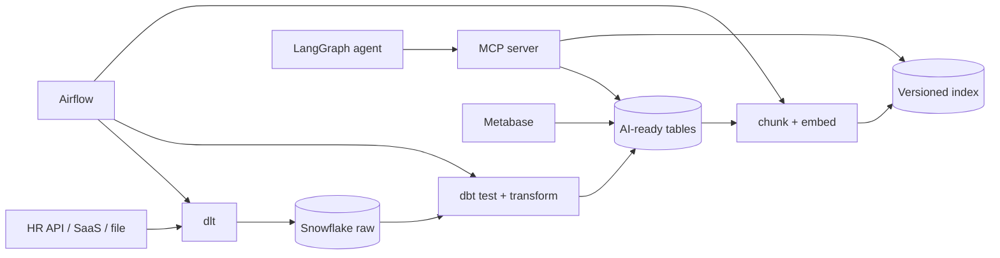

# 06 - Data platform per AI e Model Context Protocol

## Obiettivo

Costruire una knowledge base come **data product**: alimentata automaticamente,
versionata, osservabile e accessibile agli agenti tramite MCP con permessi espliciti.

Per il laboratorio locale installa `pip install -e ".[dev,ai,platform]"`. DuckDB
sostituisce Snowflake durante lo sviluppo; il progetto finale deve documentare anche
configurazione e differenze del target Snowflake.

## Architettura nello stack della posizione



### Responsabilità dei componenti

| Tecnologia | Uso |
|---|---|
| dlt | estrazione incrementale, schema evolution e load |
| Snowflake | storage governato, compute separato e access control |
| dbt | staging, trasformazioni, test, lineage e documentazione |
| Airflow | dipendenze, schedule, retry, backfill e alert |
| MCP | contratto standard fra agente, tool, resource e prompt |
| Docker | runtime riproducibile |
| AWS | artifact, compute, secrets, log e networking |
| Metabase | dashboard su freschezza, qualità, utilizzo e costo |

## Pipeline robusta per knowledge base

```text
extract incrementale
-> raw immutabile
-> validazione schema e qualità
-> normalizzazione e deduplica
-> classificazione PII/ACL
-> parsing e chunking
-> embedding
-> indice candidato
-> eval gate
-> alias alla nuova versione
-> conservazione versione precedente per rollback
```

Ogni record conserva `source_id`, `source_version`, `updated_at`, `content_hash`,
`tenant_id`, ACL e lineage. L'update è idempotente: stesso contenuto, nessun nuovo
embedding. Le cancellazioni dalla fonte devono propagarsi anche all'indice.

## dbt: qualità prima dell'indicizzazione

Modella almeno:

- `stg_documents`: tipi, timestamp e campi rinominati;
- `int_documents_deduplicated`: una versione valida per fonte;
- `ai_documents`: testo, metadata, ACL e stato di indicizzazione.

Test minimi: `unique`, `not_null`, `relationships`, valori ammessi, freschezza e un
test custom che impedisca documenti pubblicabili senza `tenant_id` o classificazione.
Usa modelli incrementali solo quando sai gestire record aggiornati e cancellati.

## Airflow: orchestrazione, non logica di dominio

Il DAG coordina task piccoli e idempotenti; trasformazioni e regole restano in dbt o
nel package Python. Configura retry solo per errori transitori, timeout, SLA, alert,
concurrency pool e backfill controllato. Il task di pubblicazione dell'indice parte
solo dopo data-quality ed eval gate.

## MCP essenziale

MCP separa:

- **host**: applicazione che usa l'agente;
- **client**: connessione dal host a un server;
- **server**: espone tool, resource e prompt;
- **resource**: contesto leggibile;
- **tool**: operazione invocabile;
- **prompt**: template riutilizzabile.

MCP standardizza il collegamento, ma non sostituisce autenticazione, autorizzazione,
validazione, timeout, audit o idempotenza.

```python
from mcp.server.fastmcp import FastMCP
from pydantic import Field

mcp = FastMCP("hr-knowledge")

@mcp.tool()
async def search_policies(
    query: str = Field(min_length=3, max_length=300),
) -> list[dict[str, str]]:
    """Search HR policies visible to the authenticated tenant."""
    # Tenant e permessi arrivano dal contesto autenticato, non dal modello.
    return []
```

Non esporre un generico `execute_sql`. Crea tool stretti come `search_policies` o
`get_employee_leave_balance`, limita righe e campi e separa read da write. Per payroll
e dati HR applica least privilege, tenant isolation, audit, redazione PII e approval.

## AWS e Docker: percorso minimo

Containerizza API, worker e MCP server con immagini multi-stage, utente non-root,
health check e tag immutabile. Un'architettura semplice:

- ECR per immagini;
- ECS/Fargate per API e worker;
- S3 per raw data e artefatti;
- Secrets Manager per credenziali;
- CloudWatch/OpenTelemetry per log, metriche e trace;
- IAM role distinta per servizio, VPC privata e security group minimi.

Scegli servizi più complessi solo con un requisito concreto.

## Laboratorio job-specific

1. Carica dati da una API mock con dlt in Snowflake o DuckDB locale.
2. Crea i tre modelli dbt, test di qualità e documentazione.
3. Crea un DAG Airflow:
   `extract -> dbt_test -> dbt_run -> index -> eval -> publish`.
4. Implementa un server MCP con una resource read-only, due tool di ricerca e un tool
   di scrittura protetto da approval e idempotency key.
5. Simula update, cancellazione, schema change, duplicato e backfill.
6. Crea dashboard Metabase per freshness, documenti scartati, eval, costo e lag.
7. Containerizza e distribuisci su AWS; dimostra rollback di servizio e indice.

**Criterio di successo:** una modifica alla fonte raggiunge la knowledge base senza
passi manuali, i dati non autorizzati non sono recuperabili, una release con eval
regressiva non viene pubblicata e il rollback non richiede re-ingestion.

## Domande da colloquio

- Come rendi un DAG safe per retry e backfill?
- Come gestisci schema evolution e cancellazioni?
- dbt test fallisce dopo il load: pubblichi comunque l'indice?
- Come propaghi identità e permessi attraverso MCP?
- Come migri un modello di embedding senza downtime?
- Quale parte deve stare in Airflow e quale nel package Python?
