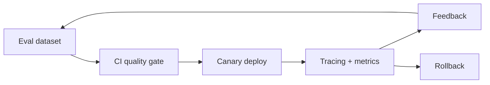

# 07 - LLMOps, valutazione e deploy

## Ciclo operativo



## Evaluation pyramid

1. **Unit test**: parser, chunker, tool, policy e prompt rendering.
2. **Component eval**: retrieval e structured output.
3. **End-to-end eval**: qualità, sicurezza, latenza e costo.
4. **Online eval**: feedback, task completion, escalation e A/B test.

Versiona insieme prompt, modello, parametri, indice, dataset e evaluator. Una metrica
senza versione della configurazione non è riproducibile.

## Serving

API essenziale:

- schema versionato;
- timeout e cancellazione;
- limiti di input e rate limit;
- streaming quando migliora il time-to-first-token;
- retry al confine corretto;
- circuit breaker e concurrency limit;
- health check che distingue processo vivo da dipendenze pronte;
- graceful shutdown.

Non restituire un successo vuoto quando il provider fallisce. Usa errori espliciti e
correlation ID.

## Osservabilità

| Segnale | Esempi |
|---|---|
| Quality | faithfulness, task success, abstention |
| Traffic | richieste, token, tenant, modello |
| Errors | timeout, parse failure, tool failure |
| Latency | TTFT, p50/p95/p99 per step |
| Cost | costo/query, cache hit, token input/output |
| Safety | injection, PII, policy violation |

Traccia prompt e output solo con policy di retention, redazione PII e accesso
controllato.

## Strategia di deploy

```text
build immutabile -> scan/test -> staging -> offline eval gate
-> canary 5% -> confronto SLO/quality -> rollout -> monitor -> rollback
```

SLO di esempio:

- disponibilità >= 99,5%;
- p95 <= 4 s;
- error rate < 1%;
- costo medio <= 0,03 euro/query;
- faithfulness >= soglia approvata sul golden set.

## Esercizi

1. Esponi RAG o agente via FastAPI con `/health/live`, `/health/ready` e `/v1/answer`.
2. Propaga `request_id`; misura durata e token di ogni step.
3. Aggiungi timeout, semaphore e una coda limitata.
4. Esegui 50 richieste concorrenti e identifica il collo di bottiglia.
5. Crea una eval CLI che confronti configurazione candidata e baseline.
6. Blocca il deploy se qualità regredisce oltre il 3%, p95 oltre il 10% o costo oltre
   il budget.
7. Simula provider lento, rate limit, indice non disponibile e output invalido.

**Criterio di successo:** il servizio degrada in modo esplicito, non perde richieste
silenziosamente e può tornare alla versione precedente senza ricostruire dati.

## Checklist pre-produzione

- threat model e data classification;
- golden set rappresentativo;
- load test e capacity estimate;
- budget e rate limit;
- dashboard e alert con owner;
- runbook per incidenti;
- canary e rollback provati;
- backup e migrazione indice;
- policy di retention e cancellazione.
