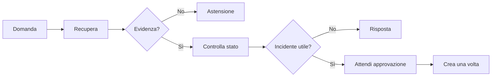

# Lezione passo-passo: costruire il capstone senza perdersi

## Cosa saprai fare e costruirai

Un assistente interno che:

1. cerca procedure autorizzate;
2. risponde usando fonti citate;
3. si astiene quando non trova una risposta;
4. legge lo stato di un servizio;
5. propone l'apertura di un incidente;
6. aspetta approvazione;
7. evita ticket duplicati;
8. espone un'API osservabile.

Non costruirai tutto insieme. Aggiungerai una funzione completa alla volta.

## Cosa devi sapere prima

Devi aver completato le lezioni passo-passo 00-07. Non serve aver terminato tutti gli
approfondimenti avanzati: li consulterai quando una fase li richiede.

## 1. Che cos'è un capstone

Un **capstone** è il progetto finale che unisce competenze studiate separatamente.

Non è:

- una demo preparata per un solo input;
- un notebook impossibile da avviare;
- una lista di tecnologie;
- un progetto enorme con metà funzioni incompiute.

È un sistema piccolo ma completo:

```text
problema -> dati -> comportamento -> test -> servizio -> misura -> documentazione
```

## 2. Parti da P0

**P0** è la versione minima realmente consegnabile. Deve funzionare localmente e
dimostrare il flusso principale.

P0 usa:

- documenti sintetici, non dati aziendali;
- DuckDB o file locali;
- retrieval BM25+dense;
- server MCP;
- workflow LangGraph;
- FastAPI;
- test ed eval;
- Docker.

Airflow, Snowflake e AWS arrivano dopo. Se P0 non funziona, il cloud aggiunge problemi
senza aggiungere valore.

## 3. Definisci il comportamento prima del codice

Scrivi cinque esempi:

### Caso 1: risposta disponibile

```text
Domanda: Come si gestisce un export payroll fallito?
Fonte autorizzata: runbook-payroll-export
Risultato: risposta con citazione.
```

### Caso 2: risposta assente

```text
Domanda: Qual è il numero privato del responsabile?
Fonte: nessuna.
Risultato: astensione.
```

### Caso 3: documento vietato

```text
Utente tenant A chiede un documento tenant B.
Risultato: nessun documento recuperato.
```

### Caso 4: proposta incidente

```text
Il servizio è down.
Risultato: proposta mostrata, nessuna scrittura.
```

### Caso 5: approvazione

```text
Utente approva il payload esatto.
Risultato: un solo incidente, anche dopo retry.
```

Questi esempi diventeranno acceptance test.

## 4. Che cos'è un acceptance test

Un **acceptance test** verifica un comportamento osservabile che rende il prodotto
accettabile.

Esempio:

```text
Dato un utente del tenant A
e un documento del tenant B
quando cerca quel documento
allora il risultato è vuoto.
```

È diverso da un unit test:

- unit test: verifica una piccola funzione;
- acceptance test: verifica una funzione completa del sistema.

Scrivi acceptance test prima delle tecnologie: descrivono che cosa deve restare vero.

## 5. Fetta verticale 1: ricerca semplice

Una **fetta verticale** attraversa tutti i layer necessari per una funzione minima.

Prima versione:

```text
file Markdown -> caricamento Python -> ricerca parola -> risultato CLI
```

Implementa:

```python
def search_documents(query: str, documents: list[Document]) -> list[Document]:
    normalized = query.lower()
    return [
        document
        for document in documents
        if normalized in document.text.lower()
    ]
```

Non è RAG sofisticato. È la baseline che prova:

- formato dei documenti;
- provenienza;
- tenant;
- interfaccia di ricerca;
- test.

Gate:

- avvio con un comando;
- risultato corretto su 10 domande;
- zero risultati cross-tenant.

## 6. Fetta verticale 2: ingestion ripetibile

Sostituisci il caricamento manuale:

```text
fonte JSONL -> dlt -> DuckDB -> tabella AI-ready
```

Aggiungi:

- `document_id`;
- `updated_at`;
- `deleted_at`;
- `content_hash`;
- `tenant_id`;
- `allowed_roles`.

Gate:

- due esecuzioni non duplicano;
- update modifica il record;
- delete lo esclude;
- record senza tenant fallisce.

## 7. Fetta verticale 3: RAG

Ora migliora la ricerca:

```text
query -> BM25 + embedding -> RRF -> top documenti
-> modello -> risposta strutturata -> verifica citazioni
```

Prima implementa e misura retrieval senza LLM. Se non recuperi il documento corretto,
il generatore non può compensare in modo affidabile.

Golden set minimo P0:

- 15 domande con risposta;
- 5 senza risposta;
- 5 cross-tenant;
- 5 con parole esatte/codici.

Gate:

- Recall@5 misurata solo sui casi con fonte;
- zero unauthorized hit;
- casi senza fonte gestiti separatamente;
- ogni citazione corrisponde a un chunk fornito.

## 8. Fetta verticale 4: MCP

Esponi capacità strette:

```text
search_runbooks(query, limit)
get_service_status(service_name)
propose_incident(title, summary, severity)
commit_incident(approval_id)
```

Per ogni tool specifica:

- input;
- output;
- identità;
- permesso richiesto;
- timeout;
- errore;
- side effect.

Un **side effect** è una modifica esterna, come creare un ticket.

`search_runbooks` è lettura. `commit_incident` è scrittura e richiede più controlli.

Gate:

- tool scoperti dal client MCP;
- schema invalido rifiutato;
- identità derivata dal token;
- nessun tool SQL generico;
- audit per ogni invocazione.

## 9. Fetta verticale 5: workflow LangGraph

Grafo:



Prima rendi deterministiche le transizioni evidenza/approval/budget. Lascia al modello
solo decisioni che richiedono interpretazione.

Gate:

- massimo numero di passi;
- timeout totale;
- checkpoint;
- resume con stesso thread ID;
- nessuna scrittura prima di approval;
- retry non duplica l'incidente.

## 10. Fetta verticale 6: API

Endpoint P0:

```text
POST /v1/answers
POST /v1/approvals/{approval_id}
GET  /v1/runs/{request_id}
GET  /health/live
GET  /health/ready
```

Gate:

- schema input/output;
- codici HTTP corretti;
- request ID;
- autenticazione fake documentata;
- errori sicuri;
- test con client HTTP.

## 11. Fetta verticale 7: osservabilità

Per una richiesta devi poter rispondere:

- quale versione era attiva?
- quali documenti sono stati recuperati?
- quale tool è stato chiamato?
- quanto tempo ha richiesto ogni passo?
- quante volte è stato fatto retry?
- quanto è costato?
- perché si è fermato?

Se non puoi rispondere, non puoi operare il servizio.

Gate:

- log strutturati;
- trace per nodo/tool;
- metriche di richieste, errori, latenza, token e costo;
- nessun testo sensibile di default.

## 12. Fetta verticale 8: Docker

Containerizza soltanto quando il servizio parte localmente.

Gate:

- immagine costruita;
- processo non-root;
- health check;
- `.env` non incluso;
- avvio con un comando;
- arresto pulito.

## 13. Solo dopo P0: P1 e P2

### P1, hardening

**Hardening** significa rendere il sistema più robusto:

- Airflow;
- dashboard;
- load test;
- fault injection;
- canary;
- runbook incidenti.

### P2, cloud

- Snowflake;
- ECR/ECS/Fargate;
- IAM;
- Terraform;
- stima costi;
- deploy e rollback temporanei.

Non dichiarare P2 completato se hai soltanto disegnato l'architettura. Puoi dichiarare
"design validato" distinguendolo da "deploy eseguito".

## 14. Diario delle decisioni

Un **ADR**, Architecture Decision Record, registra una decisione:

```text
Problema
Alternative
Scelta
Evidenza
Conseguenze
Quando rivalutare
```

Primo ADR:

```text
Scelta: DuckDB per P0.
Motivo: ambiente locale ripetibile, nessun costo cloud.
Limite: non dimostra access control e scala Snowflake.
Rivalutazione: passaggio a P2.
```

## 15. Piano settimanale P0

| Settimana | Obiettivo |
|---|---|
| 1 | casi, dati sintetici, ricerca baseline |
| 2 | dlt/DuckDB e qualità |
| 3 | retrieval ed eval |
| 4 | risposta con citazioni e MCP |
| 5 | LangGraph, approval, idempotenza |
| 6 | API, trace, Docker e demo |

Se una settimana non supera il gate, non accumulare nuove tecnologie.

## 16. Laboratorio guidato

Il laboratorio è l'intero P0 delle sezioni 3-15. Completalo in questo ordine:

1. crea i cinque acceptance test;
2. implementa la ricerca lessicale da CLI;
3. rendi l'ingestion ripetibile;
4. aggiungi RAG con citazioni e astensione;
5. pubblica letture e scritture controllate tramite MCP;
6. orchestra approvazione e idempotenza con LangGraph;
7. esponi API, log e metriche;
8. avvia tutto in Docker.

Dopo ogni passo esegui test e demo. Non iniziare il passo successivo finché il
comportamento appena aggiunto non è ripetibile da una nuova copia del repository.

## 17. Esercizi

### Base

Trasforma i cinque casi della sezione 3 in test eseguibili, inizialmente fallenti.

### Intermedio

Simula due tenant e dimostra con un test che nessuna ricerca restituisce documenti
del tenant sbagliato.

### Avanzato

Simula un timeout dopo la creazione di un incidente e un retry con la stessa chiave
di idempotenza. Dimostra che esiste un solo incidente.

## 18. Soluzioni ragionate

### Base

Crea una fixture per utente, documenti e dipendenze fake. Ogni test deve verificare
un risultato osservabile: citazione valida, astensione, lista vuota, proposta senza
scrittura e una sola scrittura dopo approvazione.

### Intermedio

Applica il filtro `tenant_id` durante il retrieval, non dopo. Un test robusto inserisce
un documento molto rilevante del tenant B e verifica che l'utente A riceva comunque
zero risultati.

### Avanzato

Salva la chiave di idempotenza e il risultato della prima operazione nello stesso
confine transazionale. Al retry restituisci il risultato salvato senza ripetere la
scrittura. Contare soltanto le chiamate in memoria non dimostra il comportamento dopo
un riavvio.

## 19. Errori comuni

- Iniziare da AWS prima del flusso locale.
- Costruire tutti i componenti senza una funzione end-to-end.
- Usare dati reali sensibili.
- Valutare il RAG guardando tre risposte.
- Mettere autorizzazione nel prompt.
- Credere che checkpoint significhi exactly-once.
- Aggiungere multi-agent per sembrare avanzati.
- Preparare soltanto happy path.
- Nascondere parti incomplete nella demo.

## 20. Domande di autoverifica

**Che cos'è una fetta verticale?**  
Una funzione minima che attraversa tutti i layer necessari e produce valore
osservabile.

**Perché partire da ricerca semplice?**  
Fornisce baseline e verifica dati, permessi e interfacce prima della complessità.

**Qual è la differenza fra P0 e P2?**  
P0 dimostra il prodotto localmente; P2 dimostra infrastruttura cloud reale.

**Perché scrivere acceptance test prima?**  
Fissano i comportamenti che tecnologie e refactoring non devono rompere.

## 21. Prossimo passo

Usa ora il [piano tecnico completo](PIANO.md) come manuale di implementazione e il
[README del capstone](README.md) come checklist finale.
