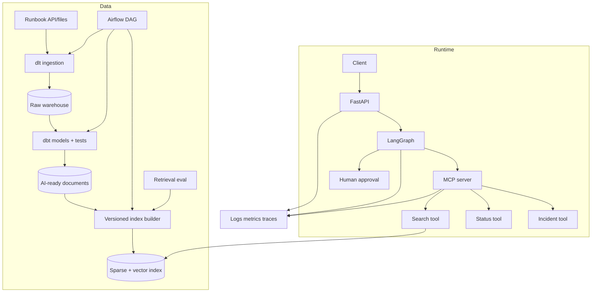

# Piano completo: AI Operations Copilot

## 1. Scenario

Un operatore interno deve risolvere anomalie seguendo runbook aggiornati. Il sistema:

1. riceve domanda e identità;
2. recupera solo documenti autorizzati;
3. risponde con citazioni;
4. legge stato di un servizio tramite MCP;
5. propone un incidente;
6. attende approvazione;
7. crea l'incidente una sola volta;
8. registra trace e metriche.

Il progetto dimostra competenze Python, ML/LLM, RAG, agenti, MCP, data engineering,
API, testing, Docker, AWS e operations.

## 2. Criteri e non-obiettivi

### Criteri

- nessun accesso cross-tenant;
- fonti e versioni verificabili;
- aggiornamento knowledge base automatizzato;
- astensione quando manca evidenza;
- scrittura con approval e idempotenza;
- eval e deploy riproducibili;
- rollback di app e indice.

### Non-obiettivi iniziali

- eseguire remediation infrastrutturali;
- modificare payroll o dati dipendente;
- memoria personale a lungo termine;
- multi-agent;
- addestrare un foundation model.

Limitare lo scope consente di completare un sistema profondo invece di una demo ampia.

### Livelli di consegna

| Livello | Implementa | Tempo indicativo |
|---|---|---:|
| P0 shippable | DuckDB/dlt/dbt, RAG+eval, MCP HTTP+ACL, LangGraph approval, FastAPI, tracing, Docker | 60-90 h |
| P1 hardening | Airflow, dashboard, load/fault test, canary simulato, runbook | 40-60 h |
| P2 cloud | Snowflake, Terraform AWS, ECS/IAM, deploy temporaneo e cost model | 50-100 h |

Le ore sono ordini di grandezza, non promesse. Completa P0 prima di espandere.
Se non puoi sostenere costi cloud, per P2 consegna Terraform validato, plan revisionato,
threat model, stima costi e un deploy temporaneo poi distrutto.

## 3. Architettura



## 4. Repository

```text
src/ai_ops/
  domain/
    models.py
    errors.py
    policies.py
  ingestion/
    sources.py
    parsing.py
    chunking.py
    index_builder.py
  retrieval/
    contracts.py
    bm25.py
    dense.py
    hybrid.py
    reranker.py
  agent/
    state.py
    nodes.py
    routing.py
    graph.py
  mcp_server/
    server.py
    context.py
    tools/
  api/
    app.py
    routes.py
    dependencies.py
  adapters/
    llm.py
    embeddings.py
    incident_store.py
  observability/
    logging.py
    metrics.py
dbt_project/
dags/
evals/
tests/
infra/
```

Dipendenze puntano verso il dominio:

```text
API/framework -> application/domain <- adapters
```

Il dominio non importa FastAPI, LangGraph, MCP o provider.

## 5. Contratti di dominio

```python
from dataclasses import dataclass
from typing import Literal

@dataclass(frozen=True)
class Principal:
    user_id: str
    tenant_id: str
    roles: frozenset[str]

@dataclass(frozen=True)
class Evidence:
    chunk_id: str
    document_id: str
    source_uri: str
    text: str
    score: float

@dataclass(frozen=True)
class Answer:
    text: str
    evidence_ids: tuple[str, ...]
    status: Literal["answered", "abstained"]
```

Invarianti:

- ogni `Evidence` appartiene al tenant del `Principal`;
- ogni citazione della risposta corrisponde a evidence fornita;
- `answered` richiede almeno un'evidenza;
- un'azione approvata è legata al payload esatto.

Scrivi test per le invarianti prima degli adapter.

## 6. Dati mock realistici

Crea:

- due tenant;
- tre ruoli per tenant;
- 40 runbook Markdown;
- versioni vecchie e correnti;
- documenti pubblici e riservati;
- duplicati;
- una cancellazione;
- una tabella;
- documenti con injection;
- API di stato fake;
- incident store fake.

Non usare dati HR reali. I dati sintetici devono comunque rappresentare casi e
distribuzioni che vuoi testare.

## 7. Fase 1: ingestion

### Source contract

```json
{
  "id": "runbook-17",
  "tenant_id": "tenant-a",
  "title": "Payroll export failure",
  "body": "...",
  "roles": ["payroll_operator"],
  "version": 3,
  "updated_at": "2026-08-01T09:00:00Z",
  "deleted_at": null
}
```

Implementa:

1. API paginata fake;
2. dlt con primary key e merge;
3. cursor `updated_at` con overlap;
4. deduplica;
5. propagazione delete;
6. load metadata.

Test:

- seconda esecuzione non duplica;
- due record stesso timestamp non si perdono;
- update tardivo viene acquisito;
- pagina 2 fallita non avanza checkpoint;
- delete viene conservato come tombstone raw.

## 8. Fase 2: dbt

Modelli:

```text
sources.yml
stg_runbooks.sql
int_runbooks_deduplicated.sql
ai_runbooks.sql
schema.yml
tests/no_publishable_document_without_acl.sql
```

`ai_runbooks` espone solo:

```text
document_id, tenant_id, title, body, roles,
source_version, source_uri, content_hash, updated_at
```

Quality gate:

- ID unico e non nullo;
- tenant e ACL presenti;
- body non vuoto;
- una sola versione attiva;
- source freshness entro budget;
- documento cancellato non pubblicabile.

Salva output e manifest dbt come artefatti del run.

## 9. Fase 3: parsing e chunking

Implementa interfacce:

```python
from typing import Protocol

class Parser(Protocol):
    def parse(self, document: SourceDocument) -> ParsedDocument: ...

class Chunker(Protocol):
    def chunk(self, document: ParsedDocument) -> list[Chunk]: ...
```

Baseline: recursive chunking per heading e poi token. Confronta:

- 250 token, overlap 30;
- 500 token, overlap 50;
- parent-child.

Verifica che metadata e ACL passino a ogni chunk. Il `chunk_id` deriva
deterministicamente da document/version/position/content hash.

## 10. Fase 4: retrieval

Implementa in ordine:

1. BM25;
2. embedding e indice dense;
3. RRF;
4. deduplica/diversity;
5. reranker opzionale.

Golden set:

| Gruppo | Numero minimo |
|---|---:|
| keyword/codice esatto | 15 |
| domanda semantica | 15 |
| multi-parte | 10 |
| senza risposta | 10 |
| tenant/ruolo vietato | 10 |

Per ogni configurazione registra Recall@5 solo sui casi answerable/autorizzati, MRR,
false-retrieval rate sui casi senza risposta, unauthorized hits, p95 e costo. Se il
reranker non migliora sufficientemente rispetto al costo, non usarlo.

## 11. Fase 5: answer generation

Output strutturato:

```python
from typing import Literal
from pydantic import BaseModel

class GeneratedAnswer(BaseModel):
    status: Literal["answered", "abstained"]
    answer: str
    cited_chunk_ids: list[str]
```

Post-validazione:

- tutti gli ID citati sono nel contesto;
- nessuna risposta `answered` senza citazione;
- massimo lunghezza;
- se fallisce, un solo repair o errore esplicito.

L'applicazione converte ID in URI: non fidarti di link inventati dal modello.

## 12. Fase 6: MCP

Server MCP espone:

- resource `runbook://{document_id}`;
- tool `search_runbooks(query, limit)`;
- tool `get_service_status(service_name)`;
- tool `propose_incident(title, summary, severity)`;
- tool interno/controllato `commit_incident(approval_id)`.

Il contesto autenticato fornisce `Principal`. I tool ignorano qualsiasi tenant nel
testo della domanda. Ogni risultato ha schema, error code e correlation ID.

Test:

- discovery/list tool;
- input invalido;
- resource non autorizzata;
- timeout;
- cancellation;
- payload troppo grande;
- output contenente injection;
- token con audience errata.

## 13. Fase 7: LangGraph

Stato:

```text
request/conversation ID
principal reference
question
step count / deadline / budget
evidence
service status
pending action
approval
final answer
error
```

Nodi:

```text
classify_intent
retrieve
check_evidence
get_status
draft_answer
propose_incident
wait_for_approval
commit_incident
finalize
fail
```

Conditional edges applicano regole deterministiche per budget, evidenza e approval.
Il modello decide solo dove la flessibilità è necessaria.

Invarianti:

- massimo passi;
- deadline propagata;
- nessuna write prima dell'approvazione;
- payload approvato immutabile;
- resume non duplica incidente.

## 14. Fase 8: API

Endpoint:

```text
POST /v1/answers
POST /v1/approvals/{approval_id}
GET  /v1/runs/{request_id}
GET  /health/live
GET  /health/ready
```

Codici:

- `400`: schema/input invalido;
- `401`: non autenticato;
- `403`: non autorizzato;
- `409`: conflitto idempotenza/stato;
- `422`: richiesta valida ma non eseguibile;
- `429`: quota;
- `503`: dipendenza/capacità temporaneamente indisponibile.

Non restituire stack trace. Restituisci `error_code`, messaggio sicuro e `request_id`.

## 15. Fase 9: osservabilità

Dashboard:

- richieste e success rate;
- answered/abstained;
- retrieval Recall su canary;
- latenza per node/tool;
- provider error e retry;
- token/costo;
- approval rate;
- incident creation;
- source freshness e index lag;
- policy violation.

Alert:

- cross-tenant o unauthorized: immediato;
- error budget burn;
- indice stale;
- costo anomalo;
- loop/budget exceeded;
- pipeline update fallita.

Ogni alert ha owner, severity e link al runbook.

## 16. Fase 10: deploy

Container:

- API;
- MCP server se processo separato;
- Airflow/local orchestration;
- componenti mock per sviluppo.

AWS target:

```text
ECR -> ECS/Fargate
ALB -> API
S3 -> source/artifact
SQS -> job async
Secrets Manager -> credentials
CloudWatch/OTel -> telemetry
IAM -> least privilege
```

Usa infrastructure as code nella cartella `infra`. In locale puoi simulare le
dipendenze, ma documenta differenze e responsabilità del target.

## 17. CI/CD

Pull request:

```text
format/lint/type
unit tests
integration tests
dbt parse/test su fixture
MCP contract tests
small eval
container build/scan
```

Main:

```text
full eval
publish immutable image
deploy staging
smoke/resilience
canary
promote o rollback
```

Un cambio solo documentale non deve chiamare provider costosi; usa path filters.

## 18. Acceptance test

1. domanda autorizzata → risposta corretta con citazione;
2. domanda senza fonte → astensione;
3. tenant B chiede documento A → nessun risultato;
4. documento contiene injection → nessun tool aggiuntivo;
5. provider timeout → errore/degradation esplicita;
6. create incident → approval richiesta;
7. doppio retry → un solo incidente;
8. crash dopo write → resume restituisce risultato esistente;
9. dbt test fallisce → indice attivo invariato;
10. eval candidata regredisce → promozione bloccata;
11. indice nuovo difettoso → alias rollback;
12. client cancella → lavoro interrotto.

## 19. ADR obbligatori

- BM25+dense e metodo di fusione;
- chunking scelto;
- vector store;
- workflow vs agente;
- confine MCP;
- checkpoint store;
- strategia idempotenza;
- modello e fallback;
- retention e PII;
- deployment e rollback.

Ogni ADR contiene benchmark e condizione di revisione.

## 20. Soluzione architetturale di riferimento

Una scelta ragionevole:

- dlt + raw warehouse per ingestion auditabile;
- dbt per qualità e modello AI-ready;
- Airflow per coordinare intervalli e quality gate;
- BM25+dense con RRF come retrieval;
- reranker solo se migliora eval;
- LangGraph ibrido con routing deterministico;
- MCP per tool/resource stretti;
- Postgres/DynamoDB per checkpoint e idempotency record;
- FastAPI async con deadline e concurrency limit;
- ECS/Fargate per semplicità operativa;
- alias dell'indice per promotion/rollback.

È una reference, non l'unica risposta. Devi giustificare sostituzioni con requisiti e
misure.

## 21. Demo finale

In 8 minuti mostra:

1. architettura e problema;
2. pipeline che acquisisce un update;
3. risposta con citazione;
4. astensione;
5. tentativo cross-tenant bloccato;
6. approval e retry idempotente;
7. dashboard/trace;
8. tabella esperimenti;
9. rollback indice.

Concludi con limiti, costo stimato e prossimi esperimenti. Una demo che mostra anche
un failure path è più credibile di una sequenza perfetta.
