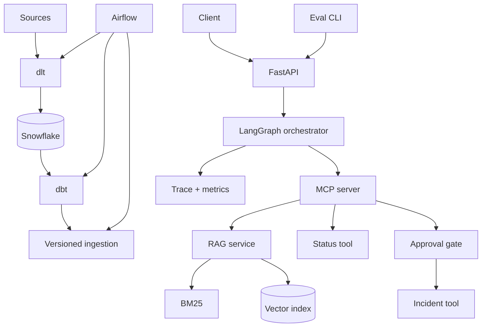

# 08 - Capstone: AI Operations Copilot

## Obiettivo

Costruisci un assistente per procedure operative interne. Risponde usando runbook,
consulta lo stato di servizi tramite tool e propone l'apertura di un incidente. Non
esegue azioni di scrittura senza approvazione.

**Inizia da qui:** [capstone passo-passo](LEZIONE.md).

**Dopo la lezione:** [piano tecnico completo](PIANO.md).

## Requisiti funzionali

1. Ingestion incrementale con dlt, Snowflake/dbt, metadati e ACL.
2. RAG ibrido con reranking, citazioni e astensione.
3. Agente LangGraph che usa un server MCP per `search_runbooks`,
   `get_service_status`, `propose_incident` e `commit_incident`.
4. Approval obbligatoria fra proposta e commit dell'incidente.
5. Orchestrazione Airflow, API asincrona e CLI di eval.
6. Golden set con almeno 60 casi:
   - 30 domande answerable;
   - 10 non answerable;
   - 10 prompt injection;
   - 10 errori/tool/permessi.

## Architettura target



## Struttura del repository da realizzare

```text
src/
  domain/          # modelli e policy, nessun framework
  ingestion/       # parser, chunking, versioning
  retrieval/       # sparse, dense, hybrid, reranking
  agent/           # state, nodes, graph
  adapters/        # provider LLM, vector DB, incident API
  mcp_server/      # resource e tool con authorization
  api/             # route e dependency wiring
dbt/
dags/
infra/
evals/
  dataset.jsonl
  evaluators.py
tests/
  unit/
  integration/
```

## Milestone

| Livello/settimane | Deliverable | Gate |
|---|---|---|
| P0, 1-2 | dlt/dbt locale, qualità e baseline BM25 | freshness e Recall@5 |
| P0, 3-4 | ingestion versionata e hybrid RAG | update/rollback provati |
| P0, 5 | MCP HTTP, LangGraph, approval | auth e traiettorie testate |
| P0, 6 | FastAPI, eval, tracing e Docker | demo locale completa |
| P1, 7-9 | Airflow, dashboard, load/failure test | SLO e runbook |
| P2, 10-12 | Snowflake, AWS e Terraform | canary, costo e rollback |

P0 è il portfolio minimo consegnabile. P1 dimostra operabilità; P2 dimostra cloud e
data-platform reale. Non iniziare P1 finché tutti gli acceptance test P0 passano.

## Definition of done

- avvio locale con un comando;
- nessun segreto o dato sensibile nei log;
- test per permission bypass e cross-tenant access;
- pipeline automatica dlt/dbt/Airflow senza aggiornamenti manuali;
- Recall@5 >= 0,85 sui casi answerable/autorizzati, citation precision >= 0,90 e zero
  unauthorized hits;
- p95 e costo entro budget dichiarato;
- azioni di scrittura idempotenti e approvate;
- diagramma, ADR principali, runbook e limitazioni;
- container non-root e IAM least-privilege;
- demo che mostra successo, astensione e recovery da errore.

## Esperimenti obbligatori

1. chunk size A/B;
2. BM25 vs dense vs hybrid;
3. con e senza reranker;
4. modello grande vs modello piccolo;
5. workflow deterministico vs agentico su costo e successo.

Presenta i risultati in una tabella. Una scelta senza misura è ancora un'ipotesi.

## Storia da colloquio

Prepara una spiegazione di cinque minuti:

`problema -> vincoli -> baseline -> architettura -> esperimenti -> failure mode
-> metriche -> compromessi -> cosa cambieresti a scala 100x`.
